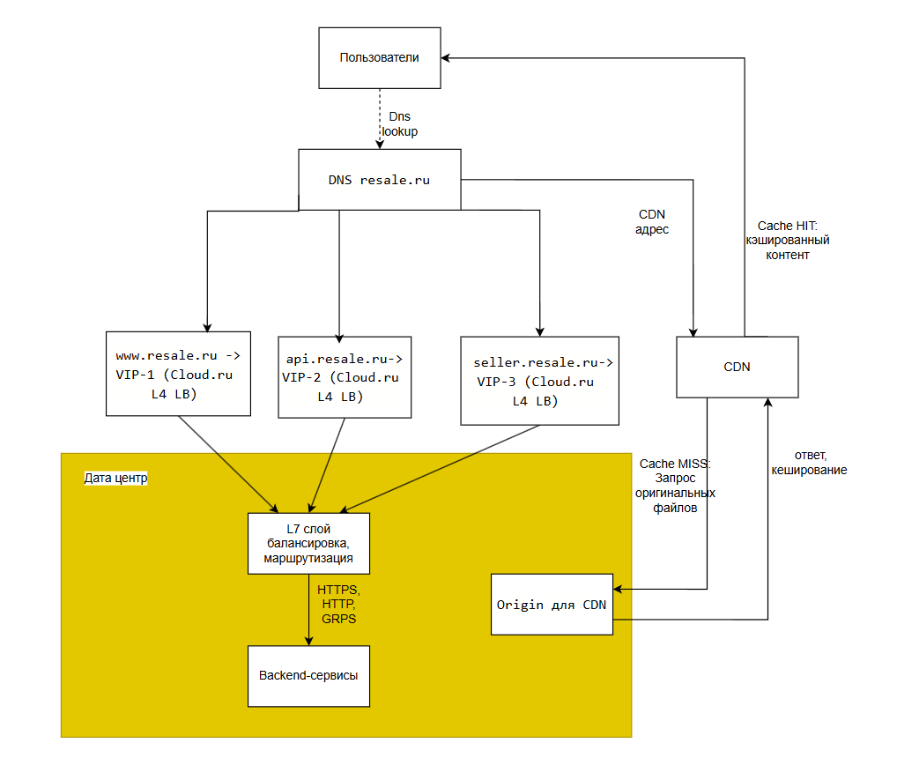

# ReSale — C2C сервис объявлений

## 1. Тема и целевая аудитория

### 1.1 Тема проекта
**ReSale** — интернет-сервис для размещения объявлений и поиска товаров между частными лицами (C2C). Пользователи публикуют объявления, ищут товары по категориям и географии.

**Фокус MVP:** вертикаль **«Товары»** (электроника, дом/ремонт, хобби и т.п.).

### 1.2 Реальные аналоги (доказательство рыночной ниши)
- Avito (Россия)
- OLX (международный)
- Facebook Marketplace (международный)
- Craigslist (США)

### 1.3 Целевая аудитория (размер и местоположение)
**Местоположение:** Россия (все регионы).

**Размер аудитории для расчётов (ориентир — масштаб Avito):**
- **MAU:** **72M+** ежемесячная аудитория. [[1]](https://ads.avito.com/platform)
- **DAU:** **22 млн** ежедневная аудитория. [[2]](https://tass.ru/ekonomika/16064459)

Прогресс по количеству контента в сервисе:
- **220+ млн активных объявлений** по итогам апреля 2023 года. [[3]](https://moskva.mts.ru/about/media-centr/soobshheniya-kompanii/novosti-mts-v-rossii-i-mire/2024-12-17/mts-adtech-i-avito-obyavili-o-partnerstve-v-oblasti-razmeshheniya-nativnoj-reklamy?ysclid=mltp0fwznz612010775)
- **2+ млн новых объявлений в день**. [[3]](https://moskva.mts.ru/about/media-centr/soobshheniya-kompanii/novosti-mts-v-rossii-i-mire/2024-12-17/mts-adtech-i-avito-obyavili-o-partnerstve-v-oblasti-razmeshheniya-nativnoj-reklamy)
- **140 млн поисковых запросов в день**. [[4]](https://habr.com/ru/companies/avito/articles/429076/?ysclid=mltpwq0zb7242650464)
- **10 сделок в секунду**. [[5]](https://career.avito.com/)

### 1.4 MVP-функционал
1. **Выдача и поиск объявлений:** персональная лента (подборки/рекомендации), категории, фильтры (цена/состояние), сортировка, геолокация (город/район).
2. **Просмотр карточки объявления:** описание, цена, фото, локация, профиль продавца, кнопка «написать».
3. **Публикация объявления:** создание/редактирование/удаление объявлений, загрузка фото.
4. **Избранное:** добавление/удаление, список избранных.
5. **Жалобы и модерация:** жалоба на объявление/пользователя, скрытие/блокировка, очередь модерации.

### 1.5 Ключевые продуктовые решения
- **Геозависимая выдача, персонализированная лента обьявлений:** ранжирование с учётом города/расстояния, а также базовой системы рекомендаций.
- **Поиск как основной способ навигации по каталогу:** пользователь может формировать запрос и уточнять его с помощью фильтров (категория, цена, состояние, сортировка). Быстрый и точный поиск является ключевым сценарием использования сервиса.
- **Доверие к продавцу как часть продукта:** у продавца отображаются рейтинг и отметка о подтвержденном профиле, что повышает доверие покупателей и влияет на конверсию в контакт.
- **Модерация и защита от мошенничества обязательны:** автоматические правила и использование ИИ для автоматизации, спорные случаи отправляются на ручную модерацию.

## 2. Расчёт нагрузки

### 2.1 Продуктовые метрики

#### Сводная таблица метрик

| Метрика | Значение |
|---|---:|
| **MAU** | **72 млн+** пользователей/мес (РФ) [[1]](https://ads.avito.com/platform) |
| **DAU** | **22 млн** пользователей/день [[2]](https://tass.ru/ekonomika/16064459) |
| Активные объявления | **220+ млн** [[3]](https://moskva.mts.ru/about/media-centr/soobshheniya-kompanii/novosti-mts-v-rossii-i-mire/2024-12-17/mts-adtech-i-avito-obyavili-o-partnerstve-v-oblasti-razmeshheniya-nativnoj-reklamy?ysclid=mltp0fwznz612010775) |
| Новые объявления | **2+ млн/день** [[3]](https://moskva.mts.ru/about/media-centr/soobshheniya-kompanii/novosti-mts-v-rossii-i-mire/2024-12-17/mts-adtech-i-avito-obyavili-o-partnerstve-v-oblasti-razmeshheniya-nativnoj-reklamy?ysclid=mltp0fwznz612010775) |
| Поисковые запросы | **140 млн/день** [[4]](https://habr.com/ru/companies/avito/articles/429076/?ysclid=mltpwq0zb7242650464) |
| Просмотры карточек (расчёт) | **141 997 830/день** |
| Контакты (расчёт) | **2 545 613/день** |
| Средний объём активных данных на пользователя (расчёт) | **0,0863 ГБ/польз.** |

#### Данные выгрузки (17.02.2026) по поисковым запросам (вертикаль «Товары»)

Источник выгрузки: файл в репозитории `data_queries_avito.xlsx`. [[11]](./%D0%9B%D0%B8%D1%81%D1%82%20Microsoft%20Excel.xlsx)

| Показатель | Значение |
|---|---:|
| Кол-во поисковых фраз в выгрузке | 1 880 |
| Суммарная частота запросов за сутки  Q_sample | 10 805 232 |
| Суммарные просмотры карточек за сутки  V_sample | 10 959 425 |
| Суммарные контакты за сутки  C_sample | 196 471 |

#### Коэффициенты поведения (по выгрузке)

Формулы:
- Просмотры на один поисковый запрос: `V/Q = V_sample / Q_sample`
- Конверсия «просмотр → контакт»: `CR(V→C) = C_sample / V_sample`
- Контакты на один поисковый запрос: `C/Q = C_sample / Q_sample`

Результаты:
- `V/Q = 10 959 425 / 10 805 232 = 1,014`
- `CR(V→C) = 196 471 / 10 959 425 = 1,79%`
- `C/Q = 196 471 / 10 805 232 = 1,82%`

#### Пересчёт на суточные метрики сервиса

Берём суточное число поисковых запросов `Q_day = 140 000 000` [[4]](https://habr.com/ru/companies/avito/articles/429076/?ysclid=mltpwq0zb7242650464).

Формулы:
- Просмотры карточек в сутки: `V_day = Q_day * (V/Q)`
- Контакты в сутки: `C_day = V_day * CR(V→C)`

Результаты:
- `V_day = 140 000 000 * 1,014 = 141 997 830`
- `C_day = 141 997 830 * 1,79% = 2 545 613`

#### Среднее количество действий пользователя в день (по DAU)

Используем `DAU = 22 000 000` [[2]](https://tass.ru/ekonomika/16064459).

Формулы:
- Действий на пользователя: `A_user = A_day / DAU`
- Избранное в сутки (допущение): `Fav_day = 0,05 * V_day`
- Жалоб в сутки (допущение): `Rep_day = 0,002 * V_day`
- Загрузка фото в сутки: `PhotoUpload_day = 7 * NewAds_day`

Результаты по действиям в сутки:
- `Fav_day = 0,05 * 141 997 830 = 7 099 892`
- `Rep_day = 0,002 * 141 997 830 = 283 996`
- `PhotoUpload_day = 7 * 2 000 000 = 14 000 000`

| Действие | Среднее на пользователя в день |
|---|---:|
| Поиск/выдача | `140 000 000 / 22 000 000 = 6,36` |
| Просмотр карточки | `141 997 830 / 22 000 000 = 6,45` |
| Запрос контакта | `2 545 613 / 22 000 000 = 0,116` |
| Избранное (добавление/удаление) | `7 099 892 / 22 000 000 = 0,323` |
| Жалоба | `283 996 / 22 000 000 = 0,013` |
| Публикация объявления (CRUD) | `2 000 000 / 22 000 000 = 0,091` |
| Загрузка фото | `14 000 000 / 22 000 000 = 0,636` |

#### Средний размер хранилища пользователя (шт. и ГБ)

Допущение по фото: минимум 6–8 фото, для расчёта принимаем **7 фото на объявление**. [[6]](https://workspace.ru/blog/kak-foto-vliyaet-na-vydachu-na-avito-chto-algoritm-schitaet-kachestvennym-kontentom-v-2025-godu/)

Промежуточные расчёты:
- `Ads_per_user = N_ads / MAU = 220 000 000 / 72 000 000 = 3,06`
- `Photos_per_user = Ads_per_user * 7 = 21,39`

Принятые размеры:
- Оригинал фото: **4 МБ** [[7]](https://dedupify.app/guides/camera-settings/)
- Уменьшенные копии фото для интерфейса: **132 КБ** (12 КБ + 120 КБ) [[8]](https://almanac.httparchive.org/en/2024/media) [[9]](https://almanac.httparchive.org/en/2024/page-weight)
- Метаданные объявления: **2 КБ** (допущение)
- Избранное: **10** записей на пользователя по **32 Б** (допущение)

Формула объёма на пользователя (по строкам):  
`S_user,i = N_user,i * S_i`

| Тип данных                                     | На пользователя (шт.) | Объём на пользователя (ГБ) |
|------------------------------------------------|---:|---:|
| Объявления (метаданные)                        | 3,06 | 0,000006 |
| Фото (оригиналы)                               | 21,39 | 0,0836 |
| Фото (уменьшенные копии)                       | 21,39 | 0,00275 |
| Избранное (связь «пользователь -> объявление») | 10 | ~0,000000 |
| **Итого**                                      | — | **0,0863** |

### 2.2 Технические метрики

#### 2.2.1 Размер хранения (в разбивке по типам данных)

Используем `N_ads = 220 000 000` [[3]](https://moskva.mts.ru/about/media-centr/soobshheniya-kompanii/novosti-mts-v-rossii-i-mire/2024-12-17/mts-adtech-i-avito-obyavili-o-partnerstve-v-oblasti-razmeshheniya-nativnoj-reklamy?ysclid=mltp0fwznz612010775) и 7 фото на объявление [[6]](https://workspace.ru/blog/kak-foto-vliyaet-na-vydachu-na-avito-chto-algoritm-schitaet-kachestvennym-kontentom-v-2025-godu/).

Промежуточный расчёт:
- `N_photo = N_ads * 7 = 1 540 000 000`

Формула хранения:  
`S_total,i = N_i * S_i`

| Тип данных | Количество (шт.) | Размер элемента | Хранение, ТБ |
|---|---:|---:|---:|
| Объявления (метаданные) | 220 000 000 | 2 КБ | 0,41 |
| Фото (оригиналы) | 1 540 000 000 | 4 МБ [[7]](https://dedupify.app/guides/camera-settings/) | 5 874,63 |
| Фото (уменьшенные копии) | 1 540 000 000 | 132 КБ [[8]](https://almanac.httparchive.org/en/2024/media) [[9]](https://almanac.httparchive.org/en/2024/page-weight) | 189,32 |
| Избранное (связь «пользователь → объявление») | 720 000 000 | 32 Б | 0,021 |
| Жалобы (хранение 30 дней) | 8 519 880 | 256 Б | 0,002 |

#### 2.2.2 RPS (в разбивке по типам запросов)

Формулы:
- `RPS_avg = N_day / 86 400`
- `RPS_peak = k_peak * RPS_avg`

Коэффициент пика: `k_peak = 3` [[10]](https://www.robustperception.io/do-you-know-your-peak-to-mean-ratio/)

| Действие | RPS_avg | RPS_peak |
|---|---:|---:|
| Поиск/выдача | 1 620,37 | 4 861,11 |
| Просмотр карточки | 1 643,49 | 4 930,48 |
| Запрос контакта | 29,46 | 88,39 |
| Избранное (добавление/удаление) | 82,17 | 246,52 |
| Жалоба | 3,29 | 9,86 |
| Публикация объявления (CRUD) | 23,15 | 69,44 |
| Загрузка фото | 162,04 | 486,11 |

#### 2.2.3 Сетевой трафик

Формулы:
- Суточный трафик: `Traffic_day,i = N_day,i * S_i`
- Среднее потребление: `BW_avg,i = (Traffic_day,i * 8) / 86 400`
- Пиковое потребление: `BW_peak,i = k_peak * BW_avg,i`

Где `k_peak = 3` [[10]](https://www.robustperception.io/do-you-know-your-peak-to-mean-ratio/)

Принятые размеры ответа/загрузки:
- Поиск/выдача: **260 КБ** [[8]](https://almanac.httparchive.org/en/2024/media)
- Просмотр карточки: **358 КБ** [[9]](https://almanac.httparchive.org/en/2024/page-weight)
- Запрос контакта: **2 КБ**
- Избранное: **1 КБ**
- Жалоба: **2 КБ**
- Публикация объявления (CRUD): **10 КБ**
- Загрузка фото: **4 МБ** [[7]](https://dedupify.app/guides/camera-settings/)

| Действие | Среднее потребление, Гбит/с | Пиковое потребление, Гбит/с | Суточный трафик, ТБ/сутки |
|---|---:|---:|---:|
| Поиск/выдача | 3,45 | 10,35 | 33,90 |
| Просмотр карточки | 4,82 | 14,46 | 47,34 |
| Запрос контакта | 0,000 | 0,001 | 0,005 |
| Избранное (добавление/удаление) | 0,001 | 0,002 | 0,007 |
| Жалоба | 0,000 | 0,000 | 0,001 |
| Публикация объявления (CRUD) | 0,002 | 0,006 | 0,019 |
| Загрузка фото | 5,44 | 16,31 | 53,41 |

**Итого по сети:**
- Среднее потребление: **13,71 Гбит/сек**
- Пиковое потребление: **41,13 Гбит/сек**
- Суточный трафик: **134,68 ТБ/сутки**

## 3. Глобальная балансировка нагрузки

### 3.1 Функциональное разбиение по доменам

Разделяем публичные точки входа, чтобы независимо масштабировать и маршрутизировать контуры.

| Контур | Домен | Назначение |
|---|---|---|
| Web | `www.resale.ru` | сайт/SPA |
| Buyer API | `api.resale.ru` | покупательские действия (поиск/выдача, карточка, контакты, избранное, жалобы) |
| Search | `search.resale.ru` | поиск/подсказки/фильтры |
| Seller API | `seller.resale.ru` | управление объявлениями (создание/редактирование/удаление) |
| Upload init | `upload.resale.ru` | инициация загрузки (получить upload URL, метаданные) |
| Media CDN | `img.resale.ru` | выдача изображений (CDN) |
| Static CDN | `static.resale.ru` | статика (JS/CSS/шрифты) (CDN) |
| Object storage origin | `s3.internal.resale.ru` | хранение медиа (origin для CDN, внутренний домен) |

### 3.2 Расположение ДЦ

Решено использовать один датацентр в Москве (MSK).

Обоснование (влияние на продуктовые метрики):
- Основная часть населения (а значит и аудитории) сосредоточена в европейской части РФ: по данным Росстата, в ЦФО+СЗФО+ЮФО+СКФО+ПФО суммарно **109,2 млн** человек при общей численности **146,15 млн** (≈ **74,7%**). [[12]](https://tass.ru/obschestvo/20338789)
- Размещение в Москве позволяет минимизировать задержку до основной доли пользователей и ускорить ключевые пользовательские сценарии (поиск/выдача и просмотр карточки), которые формируют основную нагрузку (см. раздел 2).
- Москва — крупнейший узел межоператорского обмена трафиком в РФ (MSK-IX). [[13]](https://www.msk-ix.ru/internet_exchange/)

Компенсации для пользователей восточных регионов:
- раздача изображений и статики через CDN (`img.resale.ru`, `static.resale.ru`);
- кэширование статики на клиенте и CDN.

### 3.3 Распределение нагрузки по датацентрам

Датацентр один, поэтому вся нагрузка из раздела 2 обслуживается в MSK.

Промежуточный расчёт:
- `Share_MSK = 1.0`

Формула распределения:
- `RPS_MSK = RPS_total * Share_MSK`

Распределение пиковых RPS по контурам (из раздела 2):

| Запрос (API) | RPS_peak всего | MSK (RPS_peak) |
|---|---:|---:|
| Поиск/выдача | 4 861,11 | 4 861,11 |
| Просмотр карточки | 4 930,48 | 4 930,48 |
| Запрос контакта | 88,39 | 88,39 |
| Избранное | 246,52 | 246,52 |
| Жалоба | 9,86 | 9,86 |
| Публикация объявления (CRUD) | 69,44 | 69,44 |
| Загрузка фото | 486,11 | 486,11 |

### 3.4 DNS-балансировка (GSLB)

Глобальной балансировки между датацентрами нет, поэтому DNS-схема сводится к маршрутизации на московский датацентр и выделению CDN-доменов для статики и медиа.

DNS-схема:

Внутри MSK допускается несколько VIP/ingress-адресов для отказоустойчивости, а выдача IP может выполняться через Round-Robin DNS (как отдельный DNS-механизм балансировки). [[15]](./20260220_highload_l3_v20_hse.pdf)

### 3.5 Anycast-балансировка (BGP Anycast)

Anycast между датацентрами не используется, так как датацентр только в Москве. 

Концепция Anycast и типичный сценарий применения в CDN описаны в справке Cloudflare. [[14]](https://www.cloudflare.com/learning/cdn/glossary/anycast-network/)
Поэтому anycast может применяться на стороне CDN-провайдера для доменов:
- `img.resale.ru`
- `static.resale.ru`

### 3.6 Регулировка трафика между ДЦ

Датацентр один, поэтому регулировка трафика между датацентрами отсутствует.

## Источники
1. https://ads.avito.com/platform
2. https://tass.ru/ekonomika/16064459
3. https://moskva.mts.ru/about/media-centr/soobshheniya-kompanii/novosti-mts-v-rossii-i-mire/2024-12-17/mts-adtech-i-avito-obyavili-o-partnerstve-v-oblasti-razmeshheniya-nativnoj-reklamy?ysclid=mltp0fwznz612010775
4. https://habr.com/ru/companies/avito/articles/429076/?ysclid=mltpwq0zb7242650464
5. https://career.avito.com/
6. https://workspace.ru/blog/kak-foto-vliyaet-na-vydachu-na-avito-chto-algoritm-schitaet-kachestvennym-kontentom-v-2025-godu/
7. https://dedupify.app/guides/camera-settings/
8. https://almanac.httparchive.org/en/2024/media
9. https://almanac.httparchive.org/en/2024/page-weight
10. https://www.robustperception.io/do-you-know-your-peak-to-mean-ratio/
11. Выгрузка данных по поисковым запросам за 17.02.2026 (файл `data_queries_avito.xlsx` в репозитории)
12. https://tass.ru/obschestvo/20338789
13. https://www.msk-ix.ru/internet_exchange/
14. https://www.cloudflare.com/learning/cdn/glossary/anycast-network/
15. ./20260220_highload_l3_v20_hse.pdf
