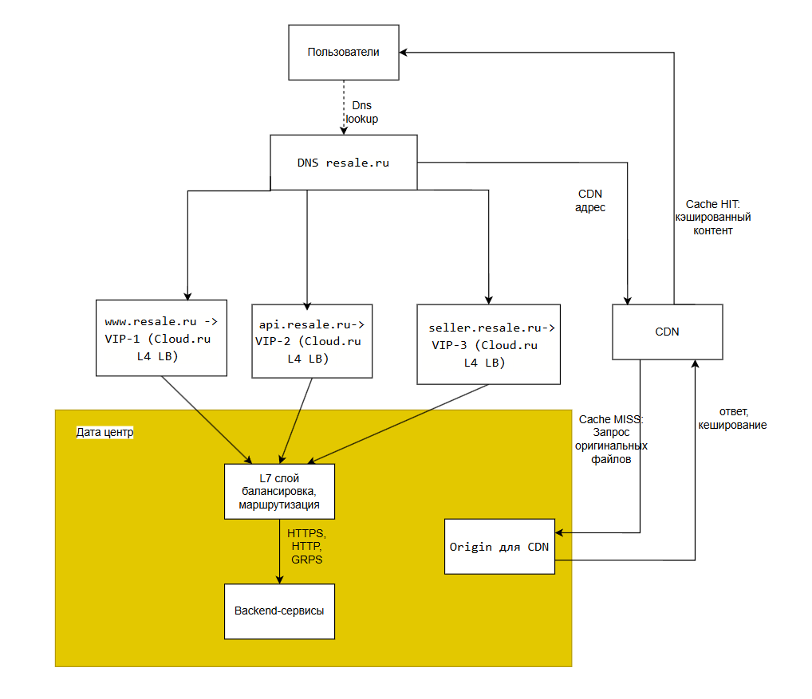
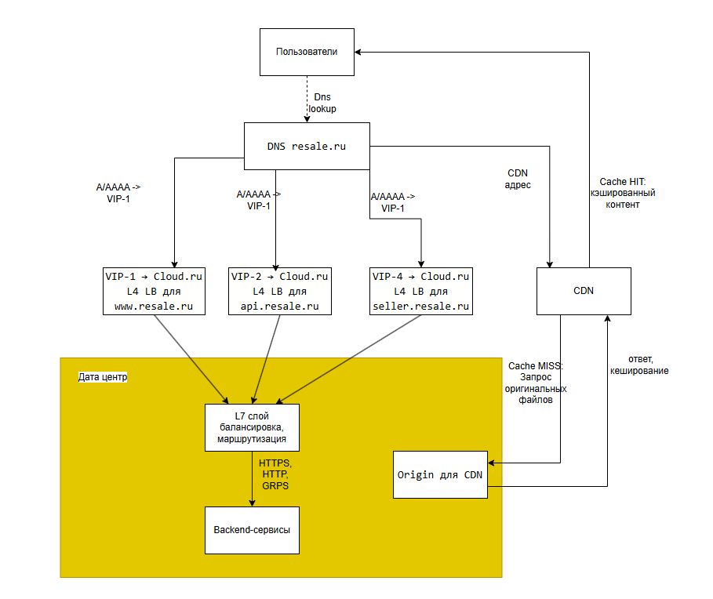
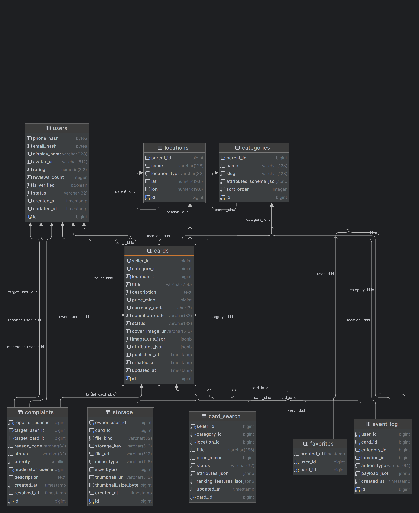
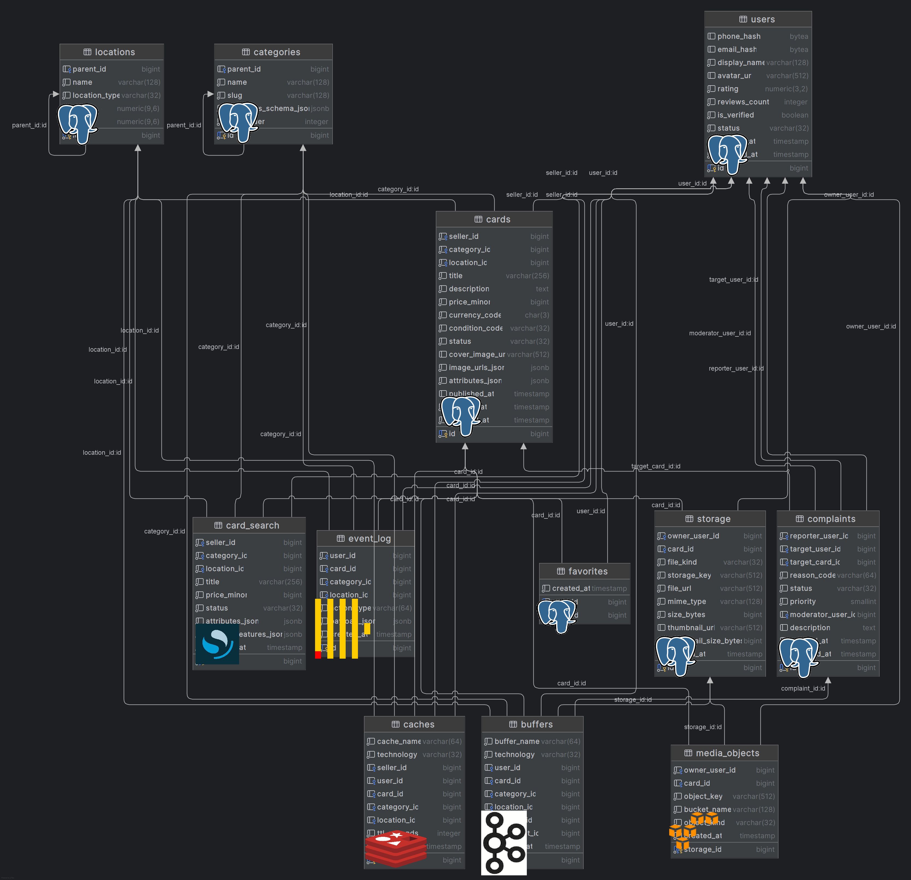

# ReSale — C2C сервис объявлений

## 1. Тема и целевая аудитория

### 1.1 Тема проекта
**ReSale** — интернет-сервис для размещения объявлений и поиска товаров между частными лицами (C2C). Пользователи публикуют объявления, ищут товары по категориям и географии.

**Фокус MVP:** вертикаль **«Товары»** (электроника, дом/ремонт, хобби и т.п.).

### 1.2 Реальные аналоги (доказательство рыночной ниши)
- Avito (Россия)
- OLX (международный)
- Facebook Marketplace (международный)
- Craigslist (США)

### 1.3 Целевая аудитория (размер и местоположение)
**Местоположение:** Россия (все регионы).

**Размер аудитории для расчётов (ориентир — масштаб Avito):**
- **MAU:** **72M+** ежемесячная аудитория. [[1]](https://ads.avito.com/platform)
- **DAU:** **22 млн** ежедневная аудитория. [[2]](https://tass.ru/ekonomika/16064459)

Прогресс по количеству контента в сервисе:
- **220+ млн активных объявлений** по итогам апреля 2023 года. [[3]](https://moskva.mts.ru/about/media-centr/soobshheniya-kompanii/novosti-mts-v-rossii-i-mire/2024-12-17/mts-adtech-i-avito-obyavili-o-partnerstve-v-oblasti-razmeshheniya-nativnoj-reklamy?ysclid=mltp0fwznz612010775)
- **2+ млн новых объявлений в день**. [[3]](https://moskva.mts.ru/about/media-centr/soobshheniya-kompanii/novosti-mts-v-rossii-i-mire/2024-12-17/mts-adtech-i-avito-obyavili-o-partnerstve-v-oblasti-razmeshheniya-nativnoj-reklamy)
- **140 млн поисковых запросов в день**. [[4]](https://habr.com/ru/companies/avito/articles/429076/?ysclid=mltpwq0zb7242650464)
- **10 сделок в секунду**. [[5]](https://career.avito.com/)

### 1.4 MVP-функционал
1. **Выдача и поиск объявлений:** персональная лента (подборки/рекомендации), категории, фильтры (цена/состояние), сортировка, геолокация (город/район).
2. **Просмотр карточки объявления:** описание, цена, фото, локация, профиль продавца, кнопка «написать».
3. **Публикация объявления:** создание/редактирование/удаление объявлений, загрузка фото.
4. **Избранное:** добавление/удаление, список избранных.
5. **Жалобы и модерация:** жалоба на объявление/пользователя, скрытие/блокировка, очередь модерации.

### 1.5 Ключевые продуктовые решения
- **Геозависимая выдача, персонализированная лента обьявлений:** ранжирование с учётом города/расстояния, а также базовой системы рекомендаций.
- **Поиск как основной способ навигации по каталогу:** пользователь может формировать запрос и уточнять его с помощью фильтров (категория, цена, состояние, сортировка). Быстрый и точный поиск является ключевым сценарием использования сервиса.
- **Доверие к продавцу как часть продукта:** у продавца отображаются рейтинг и отметка о подтвержденном профиле, что повышает доверие покупателей и влияет на конверсию в контакт.
- **Модерация и защита от мошенничества обязательны:** автоматические правила и использование ИИ для автоматизации, спорные случаи отправляются на ручную модерацию.

## 2. Расчёт нагрузки

### 2.1 Продуктовые метрики

#### Сводная таблица метрик

| Метрика | Значение |
|---|---:|
| **MAU** | **72 млн+** пользователей/мес (РФ) [[1]](https://ads.avito.com/platform) |
| **DAU** | **22 млн** пользователей/день [[2]](https://tass.ru/ekonomika/16064459) |
| Активные объявления | **220+ млн** [[3]](https://moskva.mts.ru/about/media-centr/soobshheniya-kompanii/novosti-mts-v-rossii-i-mire/2024-12-17/mts-adtech-i-avito-obyavili-o-partnerstve-v-oblasti-razmeshheniya-nativnoj-reklamy?ysclid=mltp0fwznz612010775) |
| Новые объявления | **2+ млн/день** [[3]](https://moskva.mts.ru/about/media-centr/soobshheniya-kompanii/novosti-mts-v-rossii-i-mire/2024-12-17/mts-adtech-i-avito-obyavili-o-partnerstve-v-oblasti-razmeshheniya-nativnoj-reklamy?ysclid=mltp0fwznz612010775) |
| Поисковые запросы | **140 млн/день** [[4]](https://habr.com/ru/companies/avito/articles/429076/?ysclid=mltpwq0zb7242650464) |
| Просмотры карточек (расчёт) | **141 997 830/день** |
| Контакты (расчёт) | **2 545 613/день** |
| Средний объём активных данных на пользователя (расчёт) | **0,0863 ГБ/польз.** |

#### Данные выгрузки (17.02.2026) по поисковым запросам (вертикаль «Товары»)

Источник выгрузки: файл в репозитории `data_queries_avito.xlsx`. [[11]](./%D0%9B%D0%B8%D1%81%D1%82%20Microsoft%20Excel.xlsx)

| Показатель | Значение |
|---|---:|
| Кол-во поисковых фраз в выгрузке | 1 880 |
| Суммарная частота запросов за сутки  Q_sample | 10 805 232 |
| Суммарные просмотры карточек за сутки  V_sample | 10 959 425 |
| Суммарные контакты за сутки  C_sample | 196 471 |

#### Коэффициенты поведения (по выгрузке)

Формулы:
- Просмотры на один поисковый запрос: `V/Q = V_sample / Q_sample`
- Конверсия «просмотр → контакт»: `CR(V→C) = C_sample / V_sample`
- Контакты на один поисковый запрос: `C/Q = C_sample / Q_sample`

Результаты:
- `V/Q = 10 959 425 / 10 805 232 = 1,014`
- `CR(V→C) = 196 471 / 10 959 425 = 1,79%`
- `C/Q = 196 471 / 10 805 232 = 1,82%`

#### Пересчёт на суточные метрики сервиса

Берём суточное число поисковых запросов `Q_day = 140 000 000` [[4]](https://habr.com/ru/companies/avito/articles/429076/?ysclid=mltpwq0zb7242650464).

Формулы:
- Просмотры карточек в сутки: `V_day = Q_day * (V/Q)`
- Контакты в сутки: `C_day = V_day * CR(V→C)`

Результаты:
- `V_day = 140 000 000 * 1,014 = 141 997 830`
- `C_day = 141 997 830 * 1,79% = 2 545 613`

#### Среднее количество действий пользователя в день (по DAU)

Используем `DAU = 22 000 000` [[2]](https://tass.ru/ekonomika/16064459).

Формулы:
- Действий на пользователя: `A_user = A_day / DAU`
- Избранное в сутки (допущение): `Fav_day = 0,05 * V_day`
- Жалоб в сутки (допущение): `Rep_day = 0,002 * V_day`
- Загрузка фото в сутки: `PhotoUpload_day = 7 * NewAds_day`

Результаты по действиям в сутки:
- `Fav_day = 0,05 * 141 997 830 = 7 099 892`
- `Rep_day = 0,002 * 141 997 830 = 283 996`
- `PhotoUpload_day = 7 * 2 000 000 = 14 000 000`

| Действие | Среднее на пользователя в день |
|---|---:|
| Поиск/выдача | `140 000 000 / 22 000 000 = 6,36` |
| Просмотр карточки | `141 997 830 / 22 000 000 = 6,45` |
| Запрос контакта | `2 545 613 / 22 000 000 = 0,116` |
| Избранное (добавление/удаление) | `7 099 892 / 22 000 000 = 0,323` |
| Жалоба | `283 996 / 22 000 000 = 0,013` |
| Публикация объявления (CRUD) | `2 000 000 / 22 000 000 = 0,091` |
| Загрузка фото | `14 000 000 / 22 000 000 = 0,636` |

#### Средний размер хранилища пользователя (шт. и ГБ)

Допущение по фото: минимум 6–8 фото, для расчёта принимаем **7 фото на объявление**. [[6]](https://workspace.ru/blog/kak-foto-vliyaet-na-vydachu-na-avito-chto-algoritm-schitaet-kachestvennym-kontentom-v-2025-godu/)

Промежуточные расчёты:
- `Ads_per_user = N_ads / MAU = 220 000 000 / 72 000 000 = 3,06`
- `Photos_per_user = Ads_per_user * 7 = 21,39`

Принятые размеры:
- Оригинал фото: **4 МБ** [[7]](https://dedupify.app/guides/camera-settings/)
- Уменьшенные копии фото для интерфейса: **132 КБ** (12 КБ + 120 КБ) [[8]](https://almanac.httparchive.org/en/2024/media) [[9]](https://almanac.httparchive.org/en/2024/page-weight)
- Метаданные объявления: **2 КБ** (допущение)
- Избранное: **10** записей на пользователя по **32 Б** (допущение)

Формула объёма на пользователя (по строкам):  
`S_user,i = N_user,i * S_i`

| Тип данных                                     | На пользователя (шт.) | Объём на пользователя (ГБ) |
|------------------------------------------------|---:|---:|
| Объявления (метаданные)                        | 3,06 | 0,000006 |
| Фото (оригиналы)                               | 21,39 | 0,0836 |
| Фото (уменьшенные копии)                       | 21,39 | 0,00275 |
| Избранное (связь «пользователь -> объявление») | 10 | ~0,000000 |
| **Итого**                                      | — | **0,0863** |

### 2.2 Технические метрики

#### 2.2.1 Размер хранения (в разбивке по типам данных)

Используем `N_ads = 220 000 000` [[3]](https://moskva.mts.ru/about/media-centr/soobshheniya-kompanii/novosti-mts-v-rossii-i-mire/2024-12-17/mts-adtech-i-avito-obyavili-o-partnerstve-v-oblasti-razmeshheniya-nativnoj-reklamy?ysclid=mltp0fwznz612010775) и 7 фото на объявление [[6]](https://workspace.ru/blog/kak-foto-vliyaet-na-vydachu-na-avito-chto-algoritm-schitaet-kachestvennym-kontentom-v-2025-godu/).

Промежуточный расчёт:
- `N_photo = N_ads * 7 = 1 540 000 000`

Формула хранения:  
`S_total,i = N_i * S_i`

| Тип данных | Количество (шт.) | Размер элемента | Хранение, ТБ |
|---|---:|---:|---:|
| Объявления (метаданные) | 220 000 000 | 2 КБ | 0,41 |
| Фото (оригиналы) | 1 540 000 000 | 4 МБ [[7]](https://dedupify.app/guides/camera-settings/) | 5 874,63 |
| Фото (уменьшенные копии) | 1 540 000 000 | 132 КБ [[8]](https://almanac.httparchive.org/en/2024/media) [[9]](https://almanac.httparchive.org/en/2024/page-weight) | 189,32 |
| Избранное (связь «пользователь → объявление») | 720 000 000 | 32 Б | 0,021 |
| Жалобы (хранение 30 дней) | 8 519 880 | 256 Б | 0,002 |

#### 2.2.2 RPS (в разбивке по типам запросов)

Формулы:
- `RPS_avg = N_day / 86 400`
- `RPS_peak = k_peak * RPS_avg`

Коэффициент пика: `k_peak = 3` [[10]](https://www.robustperception.io/do-you-know-your-peak-to-mean-ratio/)

| Действие | RPS_avg | RPS_peak |
|---|---:|---:|
| Поиск/выдача | 1 620,37 | 4 861,11 |
| Просмотр карточки | 1 643,49 | 4 930,48 |
| Запрос контакта | 29,46 | 88,39 |
| Избранное (добавление/удаление) | 82,17 | 246,52 |
| Жалоба | 3,29 | 9,86 |
| Публикация объявления (CRUD) | 23,15 | 69,44 |
| Загрузка фото | 162,04 | 486,11 |

#### 2.2.3 Сетевой трафик

Формулы:
- Суточный трафик: `Traffic_day,i = N_day,i * S_i`
- Среднее потребление: `BW_avg,i = (Traffic_day,i * 8) / 86 400`
- Пиковое потребление: `BW_peak,i = k_peak * BW_avg,i`

Где `k_peak = 3` [[10]](https://www.robustperception.io/do-you-know-your-peak-to-mean-ratio/)

Принятые размеры ответа/загрузки:
- Поиск/выдача: **260 КБ** [[8]](https://almanac.httparchive.org/en/2024/media)
- Просмотр карточки: **358 КБ** [[9]](https://almanac.httparchive.org/en/2024/page-weight)
- Запрос контакта: **2 КБ**
- Избранное: **1 КБ**
- Жалоба: **2 КБ**
- Публикация объявления (CRUD): **10 КБ**
- Загрузка фото: **4 МБ** [[7]](https://dedupify.app/guides/camera-settings/)

| Действие | Среднее потребление, Гбит/с | Пиковое потребление, Гбит/с | Суточный трафик, ТБ/сутки |
|---|---:|---:|---:|
| Поиск/выдача | 3,45 | 10,35 | 33,90 |
| Просмотр карточки | 4,82 | 14,46 | 47,34 |
| Запрос контакта | 0,000 | 0,001 | 0,005 |
| Избранное (добавление/удаление) | 0,001 | 0,002 | 0,007 |
| Жалоба | 0,000 | 0,000 | 0,001 |
| Публикация объявления (CRUD) | 0,002 | 0,006 | 0,019 |
| Загрузка фото | 5,44 | 16,31 | 53,41 |

**Итого по сети:**
- Среднее потребление: **13,71 Гбит/сек**
- Пиковое потребление: **41,13 Гбит/сек**
- Суточный трафик: **134,68 ТБ/сутки**

#### 2.2.4 Нагрузка на алгоритмические сервисы

После выбора алгоритмов поиска и рекомендаций появляется дополнительная внутренняя нагрузка.

В текущей версии расчёта численно оцениваются только те внутренние контуры, для которых база расчёта уже зафиксирована в разделе 2.

Формулы:

`RPS_avg = N_day / 86 400`

`RPS_peak = 3 * RPS_avg`

Для `feature-updater` входной поток считается как сумма событий, используемых в алгоритмах поиска и рекомендаций:

`Events_feature_day = Q_day + V_day + Fav_day + C_day`

Расчёт:

`Events_feature_day = 140 000 000 + 141 997 830 + 7 099 892 + 2 545 613 = 291 643 335`

`RPS_avg(feature-updater) = 291 643 335 / 86 400 = 3 375,50`

`RPS_peak(feature-updater) = 3 * 3 375,50 = 10 126,50`

#### Сводная таблица алгоритмической нагрузки

| Контур                 | Что делает                                                                         | Основа расчёта                       | RPS_avg | RPS_peak | 
|------------------------|------------------------------------------------------------------------------------|--------------------------------------|--------:|---------:|
| `search-retrieval`     | retrieval кандидатов в OpenSearch                                                  | `Поиск/выдача`                       | 1620,37 |  4861,11 |
| `feature-updater`      | обработка поведенческих сигналов из `event_log` и обновление производных признаков | `search + view + favorite + contact` | 3375,50 | 10126,50 |
| `search-index-updater` | обновление `card_search` после изменения объявления                                | `CRUD объявлений`                    |   23,15 |    69,44 |

## 3. Глобальная балансировка нагрузки

### 3.1 Функциональное разбиение по доменам

Разделение производится по доменам для изоляции контуров и масштабирования.

| Контур     | Домен              | Назначение                                                                    |
|------------|--------------------|-------------------------------------------------------------------------------|
| Web        | `www.resale.ru`    | сайт/SPA                                                                      |
| Buyer API  | `api.resale.ru`    | покупательские действия (поиск/выдача, карточка, контакты, избранное, жалобы) |
| Seller API | `seller.resale.ru` | управление объявлениями (создание/редактирование/удаление)                    |
| Media CDN  | `img.resale.ru`    | выдача изображений (CDN)                                                      |
| Static CDN | `static.resale.ru` | статика (JS/CSS/шрифты) (CDN)                                                 |

### 3.2 Расположение ДЦ

Решено использовать один датацентр в Москве (MSK).

Обоснование (влияние на продуктовые метрики):
- Основная часть населения сосредоточена в европейской части РФ: по данным Росстата, в ЦФО+СЗФО+ЮФО+СКФО+ПФО суммарно **109,2 млн** человек при общей численности **146,15 млн**. [[12]](https://tass.ru/obschestvo/20338789)
- На начало 2025 года в России насчитывается 133 миллионов пользователей интернета, это означает[[13]](https://www.web-canape.ru/business/statistika-interneta-i-socialnyh-setej-rossii-na-2025-god-glavnye-trendy-i-cifry/?ysclid=mmdq40gndk284644254&utm_referrer=https%3a%2f%2fya.ru%2f), что 91% населения страны пользуется интернетом.
- Исходя из соотношения "пользователи интернета/население страны" - количесво пользователей интернета в европейской части страны состовляет **99,4 млн** человек
- Размещение в Москве позволяет минимизировать задержку до основной доли пользователей интернета в стране.
- Москва — крупнейший узел межоператорского обмена трафиком в РФ (MSK-IX). [[14]](https://www.msk-ix.ru/about/)

Компенсации для пользователей восточных регионов:
- раздача изображений и статики через CDN (`img.resale.ru`, `static.resale.ru`);

### 3.3 Распределение нагрузки по датацентрам

Датацентр один, поэтому вся нагрузка из раздела 2 обслуживается в MSK.

Значения RPS и его пикового значения, рассчитаные во втором разделе остаются теми же самыми для одного датацентра :

| Запрос (API)                    |  MSK RPS | MSK (RPS_peak) |
|---------------------------------|---------:|---------------:|
| Поиск/выдача                    | 1 620,37 |       4 861,11 |
| Просмотр карточки               | 1 643,49 |       4 930,48 |
| Запрос контакта                 |    29,46 |          88,39 |
| Избранное (добавление/удаление) |    82,17 |         246,52 |
| Жалоба                          |     3,29 |           9,86 |
| Публикация объявления (CRUD)    |    23,15 |          69,44 |
| Загрузка фото                   |   162,04 |         486,11 |

### 3.4 DNS-балансировка (DNS + CDN)

Глобальной балансировки между датацентрами нет, поэтому DNS-схема сводится к разрешению доменных имён в VIP L4-балансировщиков и CDN для доменов статики и медиа.

DNS-схема:

## 4. Расчёт локальной балансировки нагрузки

### 4.1 Схема балансировки нагрузки

На уровне **L4** используется **Cloud.ru Evolution Load Balancer**. Балансировщик работает на уровне **L4** и не выполняет **SSL/TLS termination**, поэтому завершение TLS выносится на уровень **L7**. [[15]](https://cloud.ru/products/evolution-load-balancer)

На уровне **L7** используется **NGINX ingress/reverse-proxy**, который выполняет:

- **SSL termination**;
- **HTTP/HTTPS-маршрутизацию** запросов;
- распределение трафика по backend-сервисам. [[16]](https://blog.nginx.org/blog/testing-performance-nginx-ingress-controller-kubernetes)

Резервирование L7-групп принимается по схеме **N+1**:

`N_total = N_work + 1`

### 4.2 Расчёт количества балансировщиков

#### Сводная таблица расчёта L7

| Группа | Домен | Ограничение | Нод | CPU на ноду | Итого CPU |
|---|---|---|---:|---:|---:|
| Web | `www.resale.ru` | HTTPS CPS | 2 | 8 | 16 |
| Buyer API | `api.resale.ru` | сеть | 5 | 4 | 20 |
| Seller API | `seller.resale.ru` | сеть | 4 | 4 | 16 |
| **Итого** | — | — | **11** | — | **52** |

Для расчёта принимаются:

- `util = 0,8` — ограничение по загрузке ноды [[17]](https://www.npiontko.pro/2024/12/27/capacity-planning-utilization)
- `k_conn = 0,2` — коэффициент новых HTTPS-соединений, то есть  
  `CPS_peak = 0,2 * RPS_peak` [[19]](https://blog.cloudflare.com/measuring-network-connections-at-scale/)

По бенчмарку **NGINX Ingress Controller**:

- для профиля **4 CPU**  
  `BW_eff = 8,72 * 0,8 = 6,98 Гбит/с` [[16]](https://blog.nginx.org/blog/testing-performance-nginx-ingress-controller-kubernetes)

- для профиля **8 CPU**  
  `BW_eff = 8,64 * 0,8 = 6,91 Гбит/с`  
  `CPS_eff = 3 399 * 0,8 = 2 719 conn/s`  
  [[16]](https://blog.nginx.org/blog/testing-performance-nginx-ingress-controller-kubernetes) [[18]](https://blog.nginx.org/blog/testing-the-performance-of-nginx-and-nginx-plus-web-servers)

- для профиля **4 CPU** по HTTPS CPS  
  `CPS_eff = 1 735 * 0,8 = 1 388 conn/s` [[18]](https://blog.nginx.org/blog/testing-the-performance-of-nginx-and-nginx-plus-web-servers)

Профиль L7-ноды выбирается как минимальный по CPU, при котором сохраняется минимальное количество нод.

####  Группа `api.resale.ru`

Для `api.resale.ru`:

- `RPS_peak = 10 136,36`
- `CPS_peak = 0,2 * 10 136,36 = 2 027,27`
- `BW_peak = 24,81 Гбит/с`

Количество нод по сети:

`24,81 / 6,98 = 3,56 => 4 ноды`

Количество нод по новым HTTPS-соединениям:

`2 027,27 / 1 388 = 1,46 => 2 ноды`

Принимается:

- `N_work = max(4, 2) = 4`
- `N_total = 4 + 1 = 5`

Выбранный профиль:

- **5 нод по 4 CPU**
- `CPU_total = 5 * 4 = 20`

#### Группа `seller.resale.ru`

Для `seller.resale.ru`:

- `RPS_peak = 555,55`
- `CPS_peak = 0,2 * 555,55 = 111,11`
- `BW_peak = 16,32 Гбит/с`

Количество нод по сети:

`16,32 / 6,98 = 2,34 => 3 ноды`

Количество нод по новым HTTPS-соединениям:

`111,11 / 1 388 = 0,08 => 1 нода`

Принимается:

- `N_work = max(3, 1) = 3`
- `N_total = 3 + 1 = 4`

Выбранный профиль:

- **4 ноды по 4 CPU**
- `CPU_total = 4 * 4 = 16`

#### Группа `www.resale.ru`

Для `www.resale.ru` берётся пиковый `RPS` всей системы из раздела 2:

`RPS_peak,total = 10 691,91`

Пиковая нагрузка по новым HTTPS-соединениям:

`CPS_peak,www = 0,2 * 10 691,91 = 2 138,38`

Количество нод по новым HTTPS-соединениям для профиля **8 CPU**:

`2 138,38 / 2 719 = 0,79 => 1 нода`

Принимается:

- `N_work = 1`
- `N_total = 1 + 1 = 2`

Выбранный профиль:

- **2 ноды по 8 CPU**
- `CPU_total = 2 * 8 = 16`

## 5. Логическая схема БД

- факт запроса контакта хранится в `event_log`;
- состояние модерации хранится в `complaints`;

### 5.1 Описание таблиц

| Таблица       | Описание                                                                                                                                        |
|---------------|-------------------------------------------------------------------------------------------------------------------------------------------------|
| `users`       | Данные пользователя и публичные данные продавца: имя, рейтинг, верификация, URL аватарки, статус                                                |
| `categories`  | Иерархическая структура категорий объявлений. Поле `attributes_schema_json` хранит схему специфичных атрибутов категории                        |
| `locations`   | Иерархическая структура географии: страна, регион, город, район                                                                                 |
| `cards`       | Объявления пользователей. Поле `image_urls_json` хранит массив URL изображений, чтобы не выполнять join при выдаче карточки                     |
| `storage`     | Файловые данные: оригиналы фото и thumbnail-версии. Используется для хранения изображений объявлений и аватарок                                 |
| `favorites`   | Текущее состояние избранного пользователя                                                                                                       |
| `complaints`  | Жалобы на пользователя или объявление. Содержит также поля модерации: статус, приоритет, модератор, время решения                               |
| `event_log`   | Общий журнал действий пользователей. Сюда записываются поиск, просмотр карточки, запрос контакта, изменение объявления, жалоба и другие события. Используется не только для аналитики, но и как источник поведенческих сигналов для поиска и рекомендаций, а также как входной поток для построения производных признаков |
| `card_search` | Денормализованная поисковая проекция объявления. Обновляется асинхронно после изменения `cards`. Используется как retrieval-слой для поиска и как источник кандидатов для части recommendation path; хранит `ranking_features_json`, участвующие в ранжировании |

### 5.2 Суммарный объём хранения и нагрузки на чтение/запись

Значения `RPS` на чтение и запись получены из действий, рассчитанных в разделе 2:

- поиск/выдача — `1620,37 RPS`;
- просмотр карточки — `1643,49 RPS`;
- запрос контакта — `29,46 RPS`;
- избранное — `82,17 RPS`;
- жалоба — `3,29 RPS`;
- публикация объявления (CRUD) — `23,15 RPS`;
- загрузка фото — `162,04 RPS`.

Для таблицы `users` запись рассчитана по увеличению пользовательской аудитории на **11 млн за 2 года**:

- `Users_day = 11 000 000 / 730 = 15 068,49`
- `RPS_write(users) = 15 068,49 / 86 400 = 0,1744`

Для `categories` и `locations` запись принимается равной `0 RPS`, так как это справочники, а их изменение не входит в основной продуктовый поток нагрузки.

| Таблица       | Средний размер строки, байт | Суммарный объём хранения | Нагрузка на запись, RPS |   Нагрузка на чтение, RPS | Количество строк, выдаваемых в секунду |
|---------------|----------------------------:|-------------------------:|------------------------:|--------------------------:|---------------------------------------:|
| `users`       |                         256 |                 18,43 ГБ |                    0,17 |                   1672,95 |                                1672,95 |
| `categories`  |                         224 |                < 0,01 ТБ |                    0,00 |                   1666,64 |                                1666,64 |
| `locations`   |                         128 |                < 0,01 ТБ |                    0,00 |                   1666,64 |                                1666,64 |
| `cards`       |                       2 000 |                  0,41 ТБ |                   23,15 |                   3401,93 |                              34 188,96 |
| `storage`     |      логический объём файла |              6 063,95 ТБ |                  162,04 | основное чтение через CDN |                                      - |
| `favorites`   |                          32 |                 0,021 ТБ |                   82,17 |                   1725,66 |                                1725,66 |
| `complaints`  |                         256 |                 0,002 ТБ |                    3,29 |                      3,29 |                                   3,29 |
| `event_log`   |                         128 |                  1,08 ТБ |                 3563,97 |                      0,00 |                                   0,00 |
| `card_search` |                        1024 |                  0,20 ТБ |                   23,15 |                   1620,37 |                              32 407,40 |

Принятые размеры строки:

- `cards` — **2 КБ**, как и размер метаданных объявления в разделе 2;
- `storage` — **4 МБ + 132 КБ**, то есть оригинал фото и уменьшенная копия;
- `favorites` — **32 Б**, как и в разделе 2;
- `complaints` — **256 Б**, как и в разделе 2;
- `event_log`, `card_search` —  размеры строк по составу полей.

Для алгоритмов раздела 7 принимается, что:

1. `event_log` является не только append-only журналом, но и входным источником для построения поисковых и рекомендательных признаков;
2. `card_search` используется не только как поисковая проекция, но и как retrieval-контур для части recommendation pipeline;
3. производные признаки не выделяются в отдельные source-of-truth таблицы;
4. поисковые и рекомендательные сигналы хранятся в составе `ranking_features_json` и обновляются асинхронно.

### 5.3 Требования к консистентности

| Таблица       | Требование к консистентности                                      | Критерий к запросам                                                                                                                                  | Описание                                                                                        |
|---------------|-------------------------------------------------------------------|------------------------------------------------------------------------------------------------------------------------------------------------------|-------------------------------------------------------------------------------------------------|
| `users`       | strong consistency                                                | запись допускается только для существующего или корректно создаваемого пользователя после проверки уникальности идентификаторов и обязательных полей | Статус пользователя, верификация и публичные поля продавца должны читаться однозначно           |
| `categories`  | strong consistency                                                | запись допускается только для административного изменения справочника при существующем `parent_id` либо при создании корневой категории              | Это справочник, изменения редкие                                                                |
| `locations`   | strong consistency                                                | запись допускается только для административного изменения справочника при существующем `parent_id` либо при создании корневой локации                | Это справочник, изменения редкие                                                                |
| `cards`       | strong consistency                                                | запись допускается только если продавец существует, категория и локация валидны, а изменение выполняет владелец объявления                           | После CRUD продавец должен сразу видеть актуальное состояние объявления                         |
| `storage`     | strong consistency для метаданных, read-after-write для владельца | запись допускается только если существует владелец файла, а при наличии `card_id` объявление существует и доступно владельцу                         | После загрузки фото продавец должен сразу видеть загруженное изображение                        |
| `favorites`   | strong consistency                                                | запись допускается только если существуют пользователь и объявление, а пара (`user_id`, `card_id`) уникальна                                         | Добавление и удаление из избранного должно сразу отражаться в интерфейсе                        |
| `complaints`  | strong consistency                                                | запись допускается только если существует автор жалобы и указан хотя бы один объект жалобы: `target_user_id` или `target_card_id`                    | Жалоба не должна теряться, её статус должен меняться однозначно                                 |
| `event_log`   | at-least-once append                                              | запись допускается только как append-only событие с существующим `user_id`; связанные сущности, если переданы, должны быть валидны                   | Событие действия пользователя не должно теряться, допускается идемпотентная повторная обработка |
| `card_search` | eventual consistency                                              | запись допускается только как результат асинхронного обновления после успешной фиксации изменений в `cards`                                          | Поисковая проекция обновляется асинхронно после изменения объявления                            |

### 5.4 Особенности распределения

| Таблица       | Основные ключи доступа                            | Характер распределения  | Описание                                                                                                        |
|---------------|---------------------------------------------------|-------------------------|-----------------------------------------------------------------------------------------------------------------|
| `users`       | `id`                                              | близкое к равномерному  | Основной доступ идёт по идентификатору пользователя                                                             |
| `categories`  | `id`, `parent_id`                                 | неравномерное           | Небольшое число верхнеуровневых категорий читается чаще остальных                                               |
| `locations`   | `id`, `parent_id`                                 | неравномерное           | Крупные города и регионы дают существенно больше запросов, чем малые населённые пункты                          |
| `cards`       | `id`, `seller_id`, `category_id`, `location_id`   | выраженно неравномерное | Популярные объявления, крупные продавцы, крупные города и популярные категории формируют основную долю нагрузки |
| `storage`     | `card_id`, `storage_key`                          | выраженно неравномерное | Горячие ключи возникают на популярных объявлениях и их изображениях                                             |
| `favorites`   | `user_id`, `card_id`                              | неравномерное           | Запись в основном распределяется по `user_id`, чтение и агрегаты концентрируются на популярных `card_id`        |
| `complaints`  | `target_card_id`, `target_user_id`                | неравномерное           | Жалобы концентрируются на проблемных объявлениях и подозрительных пользователях                                 |
| `event_log`   | `user_id`, `card_id`, `action_type`               | волнообразное           | Нагрузка идёт всплесками, синхронно с пользовательскими действиями                                              |
| `card_search` | `category_id`, `location_id`, полнотекстовый ключ | выраженно неравномерное | Основной поток чтений сосредоточен в популярных категориях и крупных городах                                    |

## 6. Физическая схема БД

### 6.1 Привязка логической схемы к физическим хранилищам

Для физической схемы фиксируются следующие технологии:

- **PostgreSQL** — транзакционный OLTP-контур для `users`, `categories`, `locations`, `cards`, `storage`, `favorites`, `complaints`;
- **Ceph Object Gateway (RGW)** — основное **S3-compatible object storage** для медиа-объектов;
- **OpenSearch** — поисковая проекция `card_search`;
- **ClickHouse** — append-only журнал событий `event_log`;
- **Redis** — кэши `categories`, `locations`, `cards`, `favorites`, а также короткоживущие пользовательские embedding-векторы для online recommendation path;
- **Kafka** — буферные потоки между OLTP, search, analytics и media-processing.

**Выбор object storage:**  
В проекте используется **Ceph RGW**, потому что:

- Ceph — open-source distributed storage system [[20]](https://ceph.io/en/)
- Ceph RGW предоставляет **S3-compatible API** [[21]](https://docs.ceph.com/en/latest/radosgw/s3/)
- Ceph рассчитан на масштабируемое распределённое хранение [[22]](https://docs.ceph.com/en/reef/architecture)

### 6.2 Сводная таблица физической схемы

| Сущность | Тип | Формат хранения | Технология | Общий объём, ГБ | Шардинг | Репликация | Описание |
|---|---|---|---|---:|---|---|---|
| `users` | основная таблица | строковое OLTP-хранение | PostgreSQL | 18,43 | нет | `1 master + 2 replicas` | Профиль пользователя и публичные данные продавца. |
| `categories` | справочник | строковое OLTP-хранение | PostgreSQL | < 0,01 | нет | `1 master + 2 replicas` | Справочник категорий. |
| `locations` | справочник | строковое OLTP-хранение | PostgreSQL | < 0,01 | нет | `1 master + 2 replicas` | Справочник географии. |
| `cards` | основная таблица | строковое OLTP-хранение | PostgreSQL | 440,00 | `8 shard, hash(seller_id)` | `8 masters + 8 replicas` | Source of truth для объявления. |
| `storage` | метаданные файлов | строковое OLTP-хранение | PostgreSQL | 394,24 | `8 shard, hash(seller_id)` | `8 masters + 8 replicas` | Метаданные файлов и связей с объявлениями. |
| `media objects` | бинарные файлы | объектное хранение | Ceph RGW | 6 063 950,00 | на стороне Ceph | policy на стороне Ceph | Оригиналы фото и thumbnails. |
| `favorites` | связь many-to-many | строковое OLTP-хранение | PostgreSQL | 23,04 | `4 shard, hash(user_id)` | `4 masters + 4 replicas` | Избранное пользователя. |
| `complaints` | модерационная таблица | строковое OLTP-хранение | PostgreSQL | 2,18 | нет | `1 master + 1 replica` | Жалобы и статусы модерации. |
| `event_log` | событийный журнал | append-only + columnar | ClickHouse | 1 080,00 | `2 shard + monthly partitioning` | `2 masters + 2 replicas` | Аналитический журнал действий пользователей и входной поток для построения производных признаков `search/recommendation pipeline` |
| `card_search` | поисковая проекция | document store + inverted index | OpenSearch | 225,28 | `8 primary shard, doc_id = card_id` | `1 replica на каждый primary shard` | Полнотекстовый поиск, фильтры, сортировки, геопоиск; retrieval-слой для `search path` и части `recommendation path` |
| `caches` | кеширующий слой | key-value | Redis | 7,76 | нет | `1 master + 1 replica` | Кэши `categories`, `locations`, `cards`, `favorites`; короткоживущие служебные hot-path кэши для `search/recommendation path` |
| `buffers` | буферный слой | log / topic | Kafka | retention-based | `partition by key` | `replication factor = 3` | Буферы между OLTP, search, analytics, media pipeline и pipeline построения производных признаков |

### 6.3 Индексы

| Сущность | Индекс / структура | Тип индекса | Unique | Описание |
|---|---|---|---|---|
| `users` | `pk_users(id)` | B-tree | да | Основной доступ по пользователю. |
| `users` | `ux_users_phone_hash(phone_hash)` | B-tree | да | Контроль уникальности телефона. |
| `users` | `ux_users_email_hash(email_hash)` | B-tree | да | Контроль уникальности email. |
| `categories` | `pk_categories(id)` | B-tree | да | Точечное чтение категории. |
| `categories` | `ux_categories_slug(slug)` | B-tree | да | Доступ к категории по slug. |
| `categories` | `idx_categories_parent_sort(parent_id, sort_order)` | B-tree | нет | Построение дерева категорий. |
| `locations` | `pk_locations(id)` | B-tree | да | Точечное чтение локации. |
| `locations` | `idx_locations_parent_name(parent_id, name)` | B-tree | нет | Построение дерева локаций. |
| `cards` | `pk_cards(id)` | B-tree | да | Точечное чтение карточки. |
| `cards` | `idx_cards_seller_status_updated(seller_id, status, updated_at DESC)` | B-tree | нет | Список объявлений продавца. |
| `cards` | `idx_cards_status_published(published_at DESC) WHERE status = 'active'` | B-tree partial | нет | Служебные выборки активных объявлений. |
| `storage` | `pk_storage(id)` | B-tree | да | Точечное чтение метаданных файла. |
| `storage` | `ux_storage_key(storage_key)` | B-tree | да | Уникальность объекта в bucket. |
| `storage` | `idx_storage_card_kind(card_id, file_kind)` | B-tree | нет | Получение файлов объявления. |
| `storage` | `idx_storage_owner_created(owner_user_id, created_at DESC)` | B-tree | нет | Служебные выборки файлов пользователя. |
| `favorites` | `pk_favorites(user_id, card_id)` | B-tree | да | Проверка факта нахождения карточки в избранном. |
| `favorites` | `idx_favorites_user_created(user_id, created_at DESC)` | B-tree | нет | Выдача списка избранного пользователю. |
| `favorites` | `idx_favorites_card(card_id)` | B-tree | нет | Служебные выборки и подсчёты по объявлению. |
| `complaints` | `pk_complaints(id)` | B-tree | да | Точечное чтение жалобы. |
| `complaints` | `idx_complaints_status_priority_created(status, priority DESC, created_at)` | B-tree | нет | Очередь модерации. |
| `complaints` | `idx_complaints_target_card(target_card_id)` | B-tree | нет | Жалобы по объявлению. |
| `complaints` | `idx_complaints_target_user(target_user_id)` | B-tree | нет | Жалобы по пользователю. |
| `event_log` | `PARTITION BY toYYYYMM(created_at)` | partitioning | нет | Месячные партиции для retention. |
| `event_log` | `ORDER BY (created_at, user_id, action_type, card_id)` | sort key | нет | Порядок хранения для аналитических чтений. |
| `card_search` | `doc_id = card_id` | document id | да | Точечное обновление документа поисковой проекции. |
| `card_search` | полнотекстовые индексы по `title`, `description` | inverted index | нет | Поиск по тексту объявления. |
| `card_search` | индексы по `category_id`, `location_id`, `status`, `condition`, `price_minor`, `published_at` | inverted / doc values | нет | Фильтры, сортировки, агрегации. |
| `card_search` | `geo_point` | geo index | нет | Геофильтрация и сортировка по расстоянию. |

### 6.4 Схема документа `card_search` в OpenSearch

Размер поисковой проекции считается по числу объявлений и среднему размеру документа из раздела 5:

- `N_cards = 220 000 000`
- `S_doc = 1024 Б`

Формула:

`S_card_search = N_cards * S_doc`

Расчёт:

`S_card_search = 220 000 000 * 1024 Б = 225 280 000 000 Б = 209,8 GiB ≈ 225,28 ГБ`

Для search-heavy нагрузки рекомендуется держать размер primary shard в диапазоне **10–30 GiB**.[[23]](https://docs.aws.amazon.com/opensearch-service/latest/developerguide/bp-sharding.html).

Принимается:

- `primary shards = 8`
- `replica shards = 1`

Проверка:

`209,8 GiB / 8 = 26,2 GiB на один primary shard`

#### Таблица полей документа `card_search`
| Поле                      | Тип OpenSearch                            | Индексация           | Назначение                                                                                          |
|---------------------------|-------------------------------------------|----------------------|-----------------------------------------------------------------------------------------------------|
| `card_id`                 | `keyword`                                 | exact match          | Идентификатор документа и точечное обновление документа.                                            |
| `seller_id`               | `keyword`                                 | filter               | Фильтр по продавцу и служебные выборки.                                                             |
| `category_id`             | `keyword`                                 | filter + aggregation | Фильтр по категории и агрегации по категориям.                                                      |
| `location_id`             | `keyword`                                 | filter + aggregation | Фильтр по локации и агрегации по географии.                                                         |
| `title`                   | `text` + `title.raw: keyword`             | full-text + exact    | Полнотекстовый поиск по названию; `title.raw` используется для exact match, сортировок и агрегаций. |
| `price_minor`             | `long`                                    | range + sort         | Фильтр по диапазону цен и сортировка по цене.                                                       |
| `status`                  | `keyword`                                 | filter               | Фильтр по статусу объявления.                                                                       |
| `attributes_json.*`       | `keyword` / `long` / `double` / `boolean` | filter               | Категорийные атрибуты для facet-фильтров.                                                           |
| `ranking_features_json.*` | numeric fields                            | sort / ranking       | Предрассчитанные сигналы ранжирования.                                                              |
| `updated_at`              | `date`                                    | sort + range         | Сортировка по дате обновления и фильтры по времени.                                                 |
| `item_embedding`          | `knn_vector`                              | vector search        | векторное представление объявления для `recommendation retrieval` по близости векторов               |

### 6.5 Денормализация

| Сущность | Денормализованные поля / проекция | Описание |
|---|---|---|
| `cards` | `cover_image_url` | URL обложки хранится прямо в объявлении. |
| `cards` | `image_urls_json` | Массив URL изображений хранится прямо в объявлении. |
| `cards` | `attributes_json` | Категорийные атрибуты хранятся одним JSON-объектом. |
| `users` | `rating`, `reviews_count`, `is_verified` | Признаки доверия к продавцу хранятся в `users`. |
| `storage` | `thumbnail_url`, `thumbnail_size_bytes` | Метаданные thumbnail хранятся рядом с оригиналом. |
| `card_search` | полная поисковая проекция объявления | В одном документе собираются данные для поиска, фильтрации и сортировки. |
| `card_search` | `ranking_features_json` | Предрассчитанные сигналы ранжирования. |

---

### 6.6 Кеши и буферы

#### 6.6.1 Кеши

Используется паттерн **cache-aside** [[24]](https://learn.microsoft.com/en-us/azure/architecture/patterns/cache-aside)

Метрика cache hit ratio считается по формуле Redis:

`CHR = cache_hits / (cache_hits + cache_misses)` [[25]](https://redis.io/docs/latest/operate/rs/monitoring/get-started/)

Целевые диапазоны CHR:

- `> 90%` — excellent
- `70–90%` — good
- `< 70%` — needs attention [[26]](https://redis.io/tutorials/operate/observability/redis-software-prometheus-and-grafana/) [[27]](https://redis.io/tutorials/redis-software-observability-playbook/)

Пиковые чтения для кэшей считаются так:

- для `categories cache`, `locations cache`, `favorites cache`  
  `RPS_read_peak = RPS_read * k_peak`
- для `cards cache`  
  `RPS_read_peak = RPS_peak(card view) = 4 930,48` - кэшируется именно готовый ответ API просмотра карточки

Формулы:

`CHR_calc ≈ 1 - RPS_write_peak / RPS_read_peak`

`N_hot_keys = RPS_read_peak * TTL`

`S_hotset = N_hot_keys * S_record`

#### Таблица кэшей

| Кеш | Ключ | Что хранится | Размер записи | TTL | `RPS_read_peak` | Кол-во записей / hotset | Объём hotset | `CHR_calc` | Репликация |
|---|---|---|---:|---|---:|---:|---:|---:|---|
| `categories cache` | `categories:tree:v1` | Полное дерево категорий | `300 * 224 Б = 67 200 Б` | `1 час` | 4 999,92 | 1 | 0,07 МБ | ≈ 100% | `1 master + 1 replica` |
| `locations cache` | `locations:tree:v1` | Полное дерево локаций | `3000 * 128 Б = 384 000 Б` | `1 час` | 4 999,92 | 1 | 0,38 МБ | ≈ 100% | `1 master + 1 replica` |
| `cards cache` | `card:view:{card_id}` | Готовый JSON карточки без изображений | `2000 Б + 256 Б + 32 Б = 2288 Б` | `5 минут` | 4 930,48 | 1 479 144 | 3,38 ГБ | 98,59% | `1 master + 1 replica` |
| `favorites cache` | `favorites:{user_id}` | Список `card_id` из избранного пользователя | `10 * 32 Б = 320 Б` | `5 минут` | 5 176,98 | 1 553 094 | 0,50 ГБ | 95,24% | `1 master + 1 replica` |
| `user embedding cache` | `user_embedding:{user_id}` | Пользовательский embedding для online retrieval в recommendation path | зависит от размерности вектора | короткий TTL | не фиксируется отдельно | recommendation hotset | не фиксируется отдельно | не фиксируется отдельно | `1 master + 1 replica` |

`user embedding cache` хранятся как короткоживущие производные данные в Redis по ключу `user_embedding:{user_id}`. Эти данные пересчитываются из `event_log` через Kafka `user-actions` и используются `recommendation-service` как online-представление пользователя при запросе к OpenSearch.

#### 6.6.2 Буферы

| Буфер | Технология | Продюсер | Потребитель | Описание |
|---|---|---|---|---|
| `cards-upsert` | Kafka | Seller API, moderation service | search indexer | Асинхронное обновление `card_search` после изменения объявления. |
| `cards-delete` | Kafka | Seller API, moderation service | search indexer | Удаление или скрытие объявления из поисковой проекции. |
| `user-actions` | Kafka | Buyer API, Seller API | ClickHouse ingestor, anti-fraud, search feature updater, recommendation feature updater, ranking pipeline | Вывод пользовательских действий из OLTP в аналитический и алгоритмический контур |
| `moderation-events` | Kafka | moderation service | search indexer | Синхронизация `card_search` после модерации. |
| `media-events` | Kafka | media service | thumbnail worker, metadata updater | Асинхронная обработка изображений и обновление метаданных. |

### 6.7 Шардирование и резервирование СУБД

| Сущность / контур | Тип распределения | Ключ / правило | Шардинг | Репликация | Как работает |
|---|---|---|---|---|---|
| `users` | без шардирования | — | нет | `1 master + 2 replicas` | Единый PostgreSQL-контур. |
| `categories` | без шардирования | — | нет | `1 master + 2 replicas` | Справочник хранится целиком в одном контуре. |
| `locations` | без шардирования | — | нет | `1 master + 2 replicas` | Справочник хранится целиком в одном контуре. |
| `cards` | горизонтальное шардирование | `hash(seller_id)` | `8 shard` | `8 masters + 8 replicas` | Все объявления одного продавца живут в одном shard. |
| `storage` | горизонтальное шардирование | `hash(seller_id)` | `8 shard` | `8 masters + 8 replicas` | Метаданные файлов colocated с `cards`. |
| `media objects` | без app-level шардирования | bucket-level | на стороне Ceph | policy на стороне Ceph | Приложение работает с единым S3 API. |
| `favorites` | горизонтальное шардирование | `hash(user_id)` | `4 shard` | `4 masters + 4 replicas` | Все операции пользователя по избранному идут в один shard. |
| `complaints` | без шардирования | — | нет | `1 master + 1 replica` | Нагрузка низкая, важнее простота. |
| `event_log` | shard + partitioning | shard кластера + `toYYYYMM(created_at)` | `2 shard + monthly partitioning` | `2 masters + 2 replicas` | Высокий write throughput и retention по партициям. |
| `card_search` | индексное шардирование | `doc_id = card_id` | `8 primary shard` | `1 replica на каждый primary shard` | OpenSearch сам маршрутизирует документ в нужный shard. |
| `caches` | без шардирования | — | нет | `1 master + 1 replica` | Для MVP достаточно одного Redis primary и одной replica. |
| `buffers` | partitioning | `card_id` / `user_id` | по числу partitions | `replication factor = 3` | Порядок сообщений сохраняется внутри ключа. |

Чтобы чтение по `card_id` не требовало отдельного lookup-сервиса, в `card_id` встраивается `shard_id`, назначенный по `hash(seller_id)` в момент создания объявления.

### 6.8 Клиентские библиотеки / интеграции

| Компонент     | Библиотека                                                                                                           | Язык | Назначение                                    |
|---------------|----------------------------------------------------------------------------------------------------------------------|------|-----------------------------------------------|
| PostgreSQL    | `pgx` + `pgxpool`                                                                                                    | Go   | Основной драйвер PostgreSQL и пул соединений. |
| OpenSearch    | `opensearch-go` [[28]](https://docs.opensearch.org/latest/clients/go/)                                               | Go   | Search API и batch indexing.                  |
| ClickHouse    | `clickhouse-go`  [[29]](https://clickhouse.com/docs/integrations/go)                                                 | Go   | Запись и чтение из аналитического контура.    |
| Redis         | `go-redis`     [[30]](https://redis.io/docs/latest/develop/clients/go/)                                              | Go   | Работа с Redis и кешами.                      |
| Kafka         | `segmentio/kafka-go` [[31]](https://github.com/segmentio/kafka-go)                                                   | Go   | Producer / Consumer для Kafka.                |
| Ceph RGW / S3 | `AWSSDK.S3`          [[32]](https://docs.aws.amazon.com/sdk-for-net/v3/developer-guide/csharp_s3_code_examples.html) | .NET | Работа с S3-compatible API Ceph RGW.          |

### 6.9 Балансировка запросов / мультиплексирование подключений

Read-write split выполняется по отдельным PgBouncer-контурам:

- **RW PgBouncer** — только primary
- **RO PgBouncer** — только replicas

| Контур | Запись | Чтение | PgBouncer-контур | Маршрутизация | Назначение |
|---|---|---|---|---|---|
| PostgreSQL `coredb` | только в primary | только из replicas | `pg-core-rw`, `pg-core-ro` | без шардирования | `users`, `categories`, `locations`, `complaints` |
| PostgreSQL `cardsdb` | только в primary shard | только из replica shard | `pg-cards-rw`, `pg-cards-ro` | приложение определяет `shard_id`, затем выбирает нужный database alias | CRUD объявлений, owner-path, card view |
| PostgreSQL `mediadb` | только в primary shard | только из replica shard | `pg-media-rw`, `pg-media-ro` | приложение определяет `shard_id`, затем выбирает нужный database alias | запись и чтение метаданных файлов |
| PostgreSQL `favoritesdb` | только в primary shard | только из replica shard | `pg-favorites-rw`, `pg-favorites-ro` | приложение определяет `shard_id`, затем выбирает нужный database alias | add/remove/list favorite |
| OpenSearch | batch indexing через coordinator | search через coordinator | HTTP client pool | маршрутизация внутри OpenSearch | Поиск, фильтры, сортировки |
| ClickHouse | ingestion через writer service | distributed reads | client connection pool | маршрутизация внутри ClickHouse | Аналитика и `event_log` |
| Redis | запись в primary | чтение из primary/replica | Redis client pool | маршрутизация по key | Кэши `categories`, `locations`, `cards`, `favorites` |
| Kafka | producer в leader partition | consumer group по partition | client-managed connections | маршрутизация по message key | Асинхронные конвейеры и буферы |

### 6.10 Схема резервного копирования

Резервное копирование выполняет внутренний `backup-controller`.  
Он запускает backup по расписанию и складывает артефакты в Ceph RGW.

| Компонент | Механизм резервного копирования | Расписание | Хранение | Восстановление |
|---|---|---|---|---|
| PostgreSQL (`users`, `categories`, `locations`, `cards`, `storage`, `favorites`, `complaints`) | полный backup + WAL archiving | полный backup ежедневно, WAL сохраняется постоянно | `7 дней` PITR, `8 недель` weekly, `12 месяцев` monthly | восстановление из полного backup и WAL |
| OpenSearch (`card_search`) | snapshot индекса | каждые `6 часов` | `14` daily snapshot, `8` weekly snapshot | восстановление из snapshot + догрузка из Kafka |
| ClickHouse (`event_log`) | полный backup + incremental | полный backup ежедневно, incremental каждый час | `30` daily, `12` monthly | восстановление из полного backup и последующих incremental |
| Redis | snapshot RDB | каждые `15 минут` | `3 дня` | восстановление последнего snapshot либо прогрев из PostgreSQL |
| Kafka | retention в топиках | постоянно в пределах retention | `3 дня` | повторное построение производных данных из основных систем |
| Ceph RGW | bucket versioning + lifecycle policy | versioning включён постоянно | версии объектов `30 дней` | восстановление из истории версий |

## 7. Алгоритмы

Для ReSale такими алгоритмами являются:

1. поиск объявлений;
2. рекомендательная лента объявлений.

### 7.1 Итоговые принятые решения

1. Поиск реализуется как многоэтапный pipeline:
   `разбор запроса -> отбор кандидатов -> ранжирование -> постобработка`. [[33]](https://habr.com/ru/companies/avito/articles/846832/) [[36]](https://habr.com/ru/companies/ozontech/articles/667600/)

2. Базовый поиск  — `lexical-first search` на OpenSearch.
  [[37]](https://docs.opensearch.org/latest/vector-search/ai-search/hybrid-search/index/) 

3. Рекомендательная лента на запуске реализуется как `heuristic + content-based recommendation` на основе `event_log`, `favorites`, `cards` и `card_search`.
   Применяется на раннем этапе. [[34]](https://habr.com/ru/companies/avito/articles/338470/) [[35]](https://habr.com/ru/companies/avito/articles/1004694/)

4. Основной алгоритм рекомендаций реализуется как `candidate generation -> ranking`, где retrieval и финальное ранжирование разделены.
   Для retrieval используется `two-tower` схема, а векторный поиск выполняется внутри OpenSearch. [[35]](https://habr.com/ru/companies/avito/articles/1004694/) [[39]](https://docs.opensearch.org/latest/vector-search/) [[40]](https://docs.opensearch.org/latest/vector-search/getting-started/concepts/)

### 7.2 Алгоритм поиска объявлений

#### 7.2.1 Блок применения и постановка задачи

Блок применения: buyer-path, endpoint поиска и выдачи объявлений.

Задача: по текстовому запросу пользователя, фильтрам и географическому контексту вернуть top-N активных объявлений, релевантных запросу, с учётом категории, цены, локации, свежести и доверия к продавцу.

Поиск выполняется по отдельной поисковой проекции `card_search` в OpenSearch.

#### 7.2.2 Используемые данные и структуры

| Структура                            | Назначение                                |
| ------------------------------------ | ----------------------------------------- |
| `card_search`                        | основная поисковая проекция               |
| `categories`, `locations`            | справочники для фильтров                  |
| `users`                              | рейтинг и верификация продавца            |
| `event_log`                          | поисковые запросы и поведенческие сигналы |
| Redis                                | кэши горячих карточек и справочников      |
| Kafka `cards-upsert`, `cards-delete` | обновление поискового индекса             |

#### 7.2.3 Последовательность работы алгоритма поиска
1. Нормализация и токенизация запроса.
2. Выделение из текста категории, бренда, модели и других фильтров, если они выражены явно.
3. Отбор кандидатов в OpenSearch по обратному индексу.
4. Применение обязательных фильтров: `status = active`, категория, локация, диапазон цены, фильтры по `attributes_json`.
5. Ранжирование найденных кандидатов по лёгкой формуле.
6. Переранжирование top-K документов с учётом дополнительных факторов.
7. Постобработка: удаление дубликатов, ограничение числа объявлений одного продавца, пагинация.
8. Логирование поискового события в `event_log`.

#### 7.2.4 Формула ранжирования

Для MVP принимается формула:

`Score_search(q, d, u) = w1 · BM25(q, d) + w2 · GeoScore(u, d) + w3 · Freshness(d) + w4 · SellerTrust(d)`

где:

1. `BM25(q, d)` — текстовая релевантность;
2. `GeoScore(u, d)` — близость объявления к пользователю;
3. `Freshness(d)` — повышение веса новых объявлений;
4. `SellerTrust(d)` — доверие к продавцу: рейтинг и верификация.

На финальном шаге к выдаче дополнительно применяются правила постобработки:

1. удаление слишком похожих карточек;
2. ограничение количества объявлений одного продавца;
3. ограничение чрезмерного доминирования одной категории в первых позициях.

#### 7.2.5 Проблемы поиска и способы решения

| Проблема                        | Решение                                                                                                                                                   |
| ------------------------------- | --------------------------------------------------------------------------------------------------------------------------------------------------------- |
| Опечатки в запросе              | нечёткий поиск и исправление опечаток [[38]](https://docs.aws.amazon.com/wellarchitected/latest/amazon-opensearch-service-lens/search-workloads.html)     |
| Разные названия одного товара   | словарь синонимов и нормализация терминов [[38]](https://docs.aws.amazon.com/wellarchitected/latest/amazon-opensearch-service-lens/search-workloads.html) |
| Слишком узкая или пустая выдача | ослабление слишком жёстких условий запроса и переход к похожим объявлениям                                                                                |
| Геозависимость выдачи           | фильтр по `location_id` и географический коэффициент в ранжировании                                                                                       |
| Новые объявления без истории    | повышение веса новых объявлений и учёт доверия к продавцу                                                                                                 |
| Однообразная выдача             | удаление повторяющихся карточек и ограничение числа объявлений одного продавца                                                                            |

### 7.3 Алгоритм рекомендательной ленты объявлений

#### 7.3.1 Блок применения и постановка задачи

Блок применения:

1. главная лента;
2. блок «похожие объявления»;
3. рекомендации после просмотра карточки.

Задача: по истории действий пользователя и контексту текущей сессии построить ранжированный список объявлений, учитывающий интересы пользователя, географию, свежесть объявлений и доверие к продавцу.

#### 7.3.2 Используемые данные

| Структура              | Назначение                                                     |
| ---------------------- | -------------------------------------------------------------- |
| `event_log`            | история поисковых запросов, просмотров, избранного и контактов |
| `favorites`            | сильный сигнал интереса                                        |
| `cards`, `card_search` | источник кандидатов                                            |
| `users`                | seller trust                                                   |
| Kafka `user-actions`   | доставка событий в recommendation pipeline                     |
| Redis                  | кэш горячих данных ленты                                       |

#### 7.3.3 Последовательность работы на запуске(cold start)

На этапе запуска используется `heuristic + content-based recommendation`.

1. Из `event_log` выбираются последние действия пользователя: поисковые запросы, просмотры карточек, избранное, запросы контакта.
2. Более новые действия получают больший вес.
3. По истории строится профиль пользователя: интересующие категории, интересующий диапазон цен, интересующая география.
4. Генерируются кандидаты из нескольких источников: популярные в регионе, свежие в регионе, похожие на просмотренные, похожие на избранные.
5. На объединённом наборе кандидатов рассчитывается итоговый score.
6. Применяется постобработка: ограничение однообразия ленты, ограничение числа карточек одного продавца, исключение уже просмотренных карточек в текущей сессии.
7. Возвращается итоговый top-N.

#### 7.3.4 Формула скоринга рекомендаций

Для этапа запуска принимается формула:

`Score_rec(u, d) = a1 · ContentSim(u, d) + a2 · GeoPopularity(d) + a3 · Freshness(d) + a4 · SellerTrust(d) + a5 · PriceAffinity(u, d) - a6 · DiversityPenalty(d, L)`

где:

1. `ContentSim(u, d)` — похожесть объявления на профиль интересов пользователя;
2. `GeoPopularity(d)` — популярность объявления в регионе;
3. `Freshness(d)` — повышение веса новых объявлений;
4. `SellerTrust(d)` — доверие к продавцу;
5. `PriceAffinity(u, d)` — близость цены к привычному диапазону пользователя;
6. `DiversityPenalty(d, L)` — штраф за слишком похожие объявления в текущей ленте `L`.

#### 7.3.5 Проблемы рекомендаций и способы решения

| Проблема                                    | Решение                                                                      |
| ------------------------------------------- | ---------------------------------------------------------------------------- |
| Новый пользователь без истории              | региональная популярность и свежесть                                         |
| Новое объявление без статистики             | контентная похожесть и повышение веса новых объявлений                       |
| Быстрая смена интересов                     | повышенный вес у последних действий и поисковых запросов                     |
| Однообразная лента                          | ограничение однотипных карточек и ограничение числа карточек одного продавца |
| Доминирование слишком популярных объявлений | ограничение влияния популярности в итоговом score                            |
| Недоверие к части объявлений                | учёт модерации, рейтинга и верификации продавца                              |

#### 7.3.6 Зрелый этап развития

После накопления достаточной истории рекомендационная система переходит от простого content-based ранжирования к двухэтапной схеме:

`отбор кандидатов -> финальное ранжирование`

На этом этапе используется `two-tower` рекомендательная модель.

Первая башня строит векторное представление пользователя по его истории действий:

1. поисковые запросы;
2. просмотры;
3. избранное;
4. контакты;
5. сессионный контекст.

Вторая башня строит векторное представление объявления по его признакам:

1. категория;
2. цена;
3. география;
4. текст карточки;
5. seller trust;
6. поведенческие признаки объявления.

Формально:

`e_u = UserTower(history_u)`

`e_d = ItemTower(features_d)`

`Score_retrieval(u, d) = <e_u, e_d>`

где:

1. `e_u` — вектор пользователя;
2. `e_d` — вектор объявления;
3. `<e_u, e_d>` — скалярное произведение, которое определяет близость пользователя и объявления.

Последовательность действий алгоритма:

1. По истории пользователя строится пользовательский вектор.
2. Полученный пользовательский вектор хранится как короткоживущие производные данные в Redis и используется `recommendation-service` в online path.
3. По каталогу объявлений заранее строятся векторы карточек.
4. Векторы карточек хранятся в OpenSearch в поле `item_embedding`.
5. По близости векторов выполняется быстрый отбор кандидатов.
6. На найденном наборе кандидатов выполняется отдельное финальное ранжирование.

Итоговый score:

`Score_rec_final(u, d) = b1 · RetrievalScore(u, d) + b2 · Freshness(d) + b3 · SellerTrust(d) + b4 · PriceAffinity(u, d) - b5 · DiversityPenalty(d, L)`

Смысл данного этапа в том, что система уже не просто сравнивает карточки по заданным правилам, а  учитывает скрытые закономерности поведения пользователя. 

## 8. Технологии

| Технология                       | Область применения                                                                                                     | Мотивация выбора                                                                                    |
|----------------------------------|------------------------------------------------------------------------------------------------------------------------|-----------------------------------------------------------------------------------------------------|
| Go                               | Основной backend-контур: Buyer API, Seller API, работа с PostgreSQL, OpenSearch, ClickHouse, Redis и Kafka             | Основной серверный стек и клиентские интеграции с PostgreSQL, OpenSearch, ClickHouse, Redis и Kafka |
| .NET                             | Media-контур и взаимодействие с `Ceph RGW` через S3-compatible API                                                     | Работа с `Ceph RGW / S3` через `AWSSDK.S3`                                                          |
| Cloud.ru Evolution Load Balancer | L4-балансировка для доменов `www.resale.ru`, `api.resale.ru`, `seller.resale.ru`                                       | Внешняя L4-балансировка перед L7-контуром                                                           |
| NGINX ingress / reverse-proxy    | L7-балансировка, SSL termination, HTTP/HTTPS-маршрутизация, распределение запросов по backend-сервисам                 | SSL termination и маршрутизация запросов на уровне L7                                               |
| CDN                              | Доставка изображений через `img.resale.ru` и статики через `static.resale.ru`                                          | Разгрузка основного контура и снижение задержек при доставке медиа и статики                        |
| PostgreSQL                       | OLTP-контур: `users`, `categories`, `locations`, `cards`, `storage`, `favorites`, `complaints`                         | Транзакционное хранение, справочники, owner-path, точечные изменения состояния                      |
| PgBouncer                        | Пулы подключений и read-write split для PostgreSQL-контуров                                                            | Мультиплексирование подключений и разделение RW / RO-трафика                                        |
| Ceph Object Gateway (RGW)        | Основное объектное хранилище для оригиналов фото, thumbnails, backup-артефактов                                        | S3-compatible object storage для медиа и backup-артефактов                                          |
| OpenSearch                       | Поисковая проекция `card_search`, полнотекстовый поиск, фильтры, сортировки, геопоиск, дальнейший hybrid/vector search | Отдельный search-контур для поиска, фильтрации, сортировки и retrieval                              |
| ClickHouse                       | `event_log`, аналитический контур, хранение append-only событий пользователей                                          | Высокий поток записи событий и аналитические чтения по `event_log`                                  |
| Redis                            | Кэши `categories`, `locations`, `cards`, `favorites`, user embeddings                                                  | Hot-path cache и хранение короткоживущих производных данных                                         |
| Kafka                            | Буферные потоки `cards-upsert`, `cards-delete`, `user-actions`, `moderation-events`, `media-events`                    | Асинхронные буферы между OLTP, search, analytics, recommendation и media-контурами                  |

## Источники
1. https://ads.avito.com/platform
2. https://tass.ru/ekonomika/16064459
3. https://moskva.mts.ru/about/media-centr/soobshheniya-kompanii/novosti-mts-v-rossii-i-mire/2024-12-17/mts-adtech-i-avito-obyavili-o-partnerstve-v-oblasti-razmeshheniya-nativnoj-reklamy?ysclid=mltp0fwznz612010775
4. https://habr.com/ru/companies/avito/articles/429076/?ysclid=mltpwq0zb7242650464
5. https://career.avito.com/
6. https://workspace.ru/blog/kak-foto-vliyaet-na-vydachu-na-avito-chto-algoritm-schitaet-kachestvennym-kontentom-v-2025-godu/
7. https://dedupify.app/guides/camera-settings/
8. https://almanac.httparchive.org/en/2024/media
9. https://almanac.httparchive.org/en/2024/page-weight
10. https://www.robustperception.io/do-you-know-your-peak-to-mean-ratio/
11. Выгрузка данных по поисковым запросам за 17.02.2026 (файл `data_queries_avito.xlsx` в репозитории)
12. https://tass.ru/obschestvo/20338789
13. https://www.web-canape.ru/business/statistika-interneta-i-socialnyh-setej-rossii-na-2025-god-glavnye-trendy-i-cifry/?ysclid=mmdq40gndk284644254&utm_referrer=https%3a%2f%2fya.ru%2f
14. https://www.msk-ix.ru/about/
15. https://cloud.ru/products/evolution-load-balancer
16. https://blog.nginx.org/blog/testing-performance-nginx-ingress-controller-kubernetes
17. https://www.npiontko.pro/2024/12/27/capacity-planning-utilization
18. https://blog.nginx.org/blog/testing-the-performance-of-nginx-and-nginx-plus-web-servers
19. https://blog.cloudflare.com/measuring-network-connections-at-scale/
20. https://ceph.io/en/
21. https://docs.ceph.com/en/latest/radosgw/s3/
22. https://docs.ceph.com/en/reef/architecture
23. https://docs.aws.amazon.com/opensearch-service/latest/developerguide/bp-sharding.html
24. https://learn.microsoft.com/en-us/azure/architecture/patterns/cache-aside
25. https://redis.io/docs/latest/operate/rs/monitoring/get-started/
26. https://redis.io/tutorials/operate/observability/redis-software-prometheus-and-grafana/
27. https://redis.io/tutorials/redis-software-observability-playbook/
28. https://docs.opensearch.org/latest/clients/go/
29. https://clickhouse.com/docs/integrations/go
30. https://redis.io/docs/latest/develop/clients/go/
31. https://github.com/segmentio/kafka-go
32. https://docs.aws.amazon.com/sdk-for-net/v3/developer-guide/csharp_s3_code_examples.html
33. [https://habr.com/ru/companies/avito/articles/846832/](https://habr.com/ru/companies/avito/articles/846832/)
34. [https://habr.com/ru/companies/avito/articles/338470/](https://habr.com/ru/companies/avito/articles/338470/)
35. [https://habr.com/ru/companies/avito/articles/1004694/](https://habr.com/ru/companies/avito/articles/1004694/)
36. [https://habr.com/ru/companies/ozontech/articles/667600/](https://habr.com/ru/companies/ozontech/articles/667600/)
37. [https://docs.opensearch.org/latest/vector-search/ai-search/hybrid-search/index/](https://docs.opensearch.org/latest/vector-search/ai-search/hybrid-search/index/)
38. [https://docs.aws.amazon.com/wellarchitected/latest/amazon-opensearch-service-lens/search-workloads.html](https://docs.aws.amazon.com/wellarchitected/latest/amazon-opensearch-service-lens/search-workloads.html)
39. [https://docs.opensearch.org/latest/vector-search/](https://docs.opensearch.org/latest/vector-search/)
40. [https://docs.opensearch.org/latest/vector-search/getting-started/concepts/](https://docs.opensearch.org/latest/vector-search/getting-started/concepts/)
