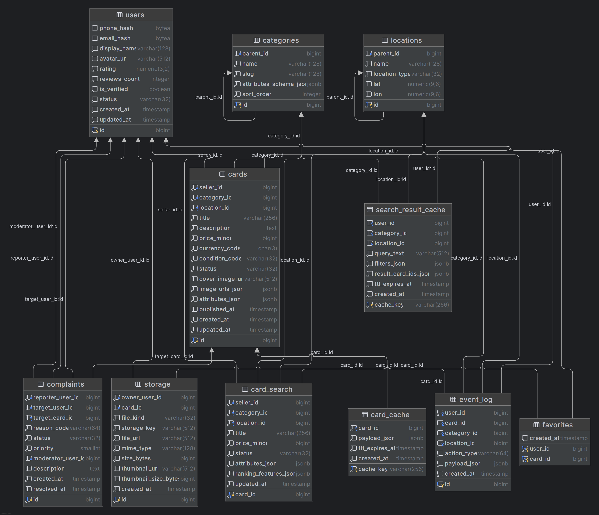

# ReSale — C2C сервис объявлений

## 1. Тема и целевая аудитория

### 1.1 Тема проекта
**ReSale** — интернет-сервис для размещения объявлений и поиска товаров между частными лицами (C2C). Пользователи публикуют объявления, ищут товары по категориям и географии.

**Фокус MVP:** вертикаль **«Товары»** (электроника, дом/ремонт, хобби и т.п.).

### 1.2 Реальные аналоги (доказательство рыночной ниши)
- Avito (Россия)
- OLX (международный)
- Facebook Marketplace (международный)
- Craigslist (США)

### 1.3 Целевая аудитория (размер и местоположение)
**Местоположение:** Россия (все регионы).

**Размер аудитории для расчётов (ориентир — масштаб Avito):**
- **MAU:** **72M+** ежемесячная аудитория. [[1]](https://ads.avito.com/platform)
- **DAU:** **22 млн** ежедневная аудитория. [[2]](https://tass.ru/ekonomika/16064459)

Прогресс по количеству контента в сервисе:
- **220+ млн активных объявлений** по итогам апреля 2023 года. [[3]](https://moskva.mts.ru/about/media-centr/soobshheniya-kompanii/novosti-mts-v-rossii-i-mire/2024-12-17/mts-adtech-i-avito-obyavili-o-partnerstve-v-oblasti-razmeshheniya-nativnoj-reklamy?ysclid=mltp0fwznz612010775)
- **2+ млн новых объявлений в день**. [[3]](https://moskva.mts.ru/about/media-centr/soobshheniya-kompanii/novosti-mts-v-rossii-i-mire/2024-12-17/mts-adtech-i-avito-obyavili-o-partnerstve-v-oblasti-razmeshheniya-nativnoj-reklamy)
- **140 млн поисковых запросов в день**. [[4]](https://habr.com/ru/companies/avito/articles/429076/?ysclid=mltpwq0zb7242650464)
- **10 сделок в секунду**. [[5]](https://career.avito.com/)

### 1.4 MVP-функционал
1. **Выдача и поиск объявлений:** персональная лента (подборки/рекомендации), категории, фильтры (цена/состояние), сортировка, геолокация (город/район).
2. **Просмотр карточки объявления:** описание, цена, фото, локация, профиль продавца, кнопка «написать».
3. **Публикация объявления:** создание/редактирование/удаление объявлений, загрузка фото.
4. **Избранное:** добавление/удаление, список избранных.
5. **Жалобы и модерация:** жалоба на объявление/пользователя, скрытие/блокировка, очередь модерации.

### 1.5 Ключевые продуктовые решения
- **Геозависимая выдача, персонализированная лента обьявлений:** ранжирование с учётом города/расстояния, а также базовой системы рекомендаций.
- **Поиск как основной способ навигации по каталогу:** пользователь может формировать запрос и уточнять его с помощью фильтров (категория, цена, состояние, сортировка). Быстрый и точный поиск является ключевым сценарием использования сервиса.
- **Доверие к продавцу как часть продукта:** у продавца отображаются рейтинг и отметка о подтвержденном профиле, что повышает доверие покупателей и влияет на конверсию в контакт.
- **Модерация и защита от мошенничества обязательны:** автоматические правила и использование ИИ для автоматизации, спорные случаи отправляются на ручную модерацию.

## 2. Расчёт нагрузки

### 2.1 Продуктовые метрики

#### Сводная таблица метрик

| Метрика | Значение |
|---|---:|
| **MAU** | **72 млн+** пользователей/мес (РФ) [[1]](https://ads.avito.com/platform) |
| **DAU** | **22 млн** пользователей/день [[2]](https://tass.ru/ekonomika/16064459) |
| Активные объявления | **220+ млн** [[3]](https://moskva.mts.ru/about/media-centr/soobshheniya-kompanii/novosti-mts-v-rossii-i-mire/2024-12-17/mts-adtech-i-avito-obyavili-o-partnerstve-v-oblasti-razmeshheniya-nativnoj-reklamy?ysclid=mltp0fwznz612010775) |
| Новые объявления | **2+ млн/день** [[3]](https://moskva.mts.ru/about/media-centr/soobshheniya-kompanii/novosti-mts-v-rossii-i-mire/2024-12-17/mts-adtech-i-avito-obyavili-o-partnerstve-v-oblasti-razmeshheniya-nativnoj-reklamy?ysclid=mltp0fwznz612010775) |
| Поисковые запросы | **140 млн/день** [[4]](https://habr.com/ru/companies/avito/articles/429076/?ysclid=mltpwq0zb7242650464) |
| Просмотры карточек (расчёт) | **141 997 830/день** |
| Контакты (расчёт) | **2 545 613/день** |
| Средний объём активных данных на пользователя (расчёт) | **0,0863 ГБ/польз.** |

#### Данные выгрузки (17.02.2026) по поисковым запросам (вертикаль «Товары»)

Источник выгрузки: файл в репозитории `data_queries_avito.xlsx`. [[11]](./%D0%9B%D0%B8%D1%81%D1%82%20Microsoft%20Excel.xlsx)

| Показатель | Значение |
|---|---:|
| Кол-во поисковых фраз в выгрузке | 1 880 |
| Суммарная частота запросов за сутки  Q_sample | 10 805 232 |
| Суммарные просмотры карточек за сутки  V_sample | 10 959 425 |
| Суммарные контакты за сутки  C_sample | 196 471 |

#### Коэффициенты поведения (по выгрузке)

Формулы:
- Просмотры на один поисковый запрос: `V/Q = V_sample / Q_sample`
- Конверсия «просмотр → контакт»: `CR(V→C) = C_sample / V_sample`
- Контакты на один поисковый запрос: `C/Q = C_sample / Q_sample`

Результаты:
- `V/Q = 10 959 425 / 10 805 232 = 1,014`
- `CR(V→C) = 196 471 / 10 959 425 = 1,79%`
- `C/Q = 196 471 / 10 805 232 = 1,82%`

#### Пересчёт на суточные метрики сервиса

Берём суточное число поисковых запросов `Q_day = 140 000 000` [[4]](https://habr.com/ru/companies/avito/articles/429076/?ysclid=mltpwq0zb7242650464).

Формулы:
- Просмотры карточек в сутки: `V_day = Q_day * (V/Q)`
- Контакты в сутки: `C_day = V_day * CR(V→C)`

Результаты:
- `V_day = 140 000 000 * 1,014 = 141 997 830`
- `C_day = 141 997 830 * 1,79% = 2 545 613`

#### Среднее количество действий пользователя в день (по DAU)

Используем `DAU = 22 000 000` [[2]](https://tass.ru/ekonomika/16064459).

Формулы:
- Действий на пользователя: `A_user = A_day / DAU`
- Избранное в сутки (допущение): `Fav_day = 0,05 * V_day`
- Жалоб в сутки (допущение): `Rep_day = 0,002 * V_day`
- Загрузка фото в сутки: `PhotoUpload_day = 7 * NewAds_day`

Результаты по действиям в сутки:
- `Fav_day = 0,05 * 141 997 830 = 7 099 892`
- `Rep_day = 0,002 * 141 997 830 = 283 996`
- `PhotoUpload_day = 7 * 2 000 000 = 14 000 000`

| Действие | Среднее на пользователя в день |
|---|---:|
| Поиск/выдача | `140 000 000 / 22 000 000 = 6,36` |
| Просмотр карточки | `141 997 830 / 22 000 000 = 6,45` |
| Запрос контакта | `2 545 613 / 22 000 000 = 0,116` |
| Избранное (добавление/удаление) | `7 099 892 / 22 000 000 = 0,323` |
| Жалоба | `283 996 / 22 000 000 = 0,013` |
| Публикация объявления (CRUD) | `2 000 000 / 22 000 000 = 0,091` |
| Загрузка фото | `14 000 000 / 22 000 000 = 0,636` |

#### Средний размер хранилища пользователя (шт. и ГБ)

Допущение по фото: минимум 6–8 фото, для расчёта принимаем **7 фото на объявление**. [[6]](https://workspace.ru/blog/kak-foto-vliyaet-na-vydachu-na-avito-chto-algoritm-schitaet-kachestvennym-kontentom-v-2025-godu/)

Промежуточные расчёты:
- `Ads_per_user = N_ads / MAU = 220 000 000 / 72 000 000 = 3,06`
- `Photos_per_user = Ads_per_user * 7 = 21,39`

Принятые размеры:
- Оригинал фото: **4 МБ** [[7]](https://dedupify.app/guides/camera-settings/)
- Уменьшенные копии фото для интерфейса: **132 КБ** (12 КБ + 120 КБ) [[8]](https://almanac.httparchive.org/en/2024/media) [[9]](https://almanac.httparchive.org/en/2024/page-weight)
- Метаданные объявления: **2 КБ** (допущение)
- Избранное: **10** записей на пользователя по **32 Б** (допущение)

Формула объёма на пользователя (по строкам):  
`S_user,i = N_user,i * S_i`

| Тип данных                                     | На пользователя (шт.) | Объём на пользователя (ГБ) |
|------------------------------------------------|---:|---:|
| Объявления (метаданные)                        | 3,06 | 0,000006 |
| Фото (оригиналы)                               | 21,39 | 0,0836 |
| Фото (уменьшенные копии)                       | 21,39 | 0,00275 |
| Избранное (связь «пользователь -> объявление») | 10 | ~0,000000 |
| **Итого**                                      | — | **0,0863** |

### 2.2 Технические метрики

#### 2.2.1 Размер хранения (в разбивке по типам данных)

Используем `N_ads = 220 000 000` [[3]](https://moskva.mts.ru/about/media-centr/soobshheniya-kompanii/novosti-mts-v-rossii-i-mire/2024-12-17/mts-adtech-i-avito-obyavili-o-partnerstve-v-oblasti-razmeshheniya-nativnoj-reklamy?ysclid=mltp0fwznz612010775) и 7 фото на объявление [[6]](https://workspace.ru/blog/kak-foto-vliyaet-na-vydachu-na-avito-chto-algoritm-schitaet-kachestvennym-kontentom-v-2025-godu/).

Промежуточный расчёт:
- `N_photo = N_ads * 7 = 1 540 000 000`

Формула хранения:  
`S_total,i = N_i * S_i`

| Тип данных | Количество (шт.) | Размер элемента | Хранение, ТБ |
|---|---:|---:|---:|
| Объявления (метаданные) | 220 000 000 | 2 КБ | 0,41 |
| Фото (оригиналы) | 1 540 000 000 | 4 МБ [[7]](https://dedupify.app/guides/camera-settings/) | 5 874,63 |
| Фото (уменьшенные копии) | 1 540 000 000 | 132 КБ [[8]](https://almanac.httparchive.org/en/2024/media) [[9]](https://almanac.httparchive.org/en/2024/page-weight) | 189,32 |
| Избранное (связь «пользователь → объявление») | 720 000 000 | 32 Б | 0,021 |
| Жалобы (хранение 30 дней) | 8 519 880 | 256 Б | 0,002 |

#### 2.2.2 RPS (в разбивке по типам запросов)

Формулы:
- `RPS_avg = N_day / 86 400`
- `RPS_peak = k_peak * RPS_avg`

Коэффициент пика: `k_peak = 3` [[10]](https://www.robustperception.io/do-you-know-your-peak-to-mean-ratio/)

| Действие | RPS_avg | RPS_peak |
|---|---:|---:|
| Поиск/выдача | 1 620,37 | 4 861,11 |
| Просмотр карточки | 1 643,49 | 4 930,48 |
| Запрос контакта | 29,46 | 88,39 |
| Избранное (добавление/удаление) | 82,17 | 246,52 |
| Жалоба | 3,29 | 9,86 |
| Публикация объявления (CRUD) | 23,15 | 69,44 |
| Загрузка фото | 162,04 | 486,11 |

#### 2.2.3 Сетевой трафик

Формулы:
- Суточный трафик: `Traffic_day,i = N_day,i * S_i`
- Среднее потребление: `BW_avg,i = (Traffic_day,i * 8) / 86 400`
- Пиковое потребление: `BW_peak,i = k_peak * BW_avg,i`

Где `k_peak = 3` [[10]](https://www.robustperception.io/do-you-know-your-peak-to-mean-ratio/)

Принятые размеры ответа/загрузки:
- Поиск/выдача: **260 КБ** [[8]](https://almanac.httparchive.org/en/2024/media)
- Просмотр карточки: **358 КБ** [[9]](https://almanac.httparchive.org/en/2024/page-weight)
- Запрос контакта: **2 КБ**
- Избранное: **1 КБ**
- Жалоба: **2 КБ**
- Публикация объявления (CRUD): **10 КБ**
- Загрузка фото: **4 МБ** [[7]](https://dedupify.app/guides/camera-settings/)

| Действие | Среднее потребление, Гбит/с | Пиковое потребление, Гбит/с | Суточный трафик, ТБ/сутки |
|---|---:|---:|---:|
| Поиск/выдача | 3,45 | 10,35 | 33,90 |
| Просмотр карточки | 4,82 | 14,46 | 47,34 |
| Запрос контакта | 0,000 | 0,001 | 0,005 |
| Избранное (добавление/удаление) | 0,001 | 0,002 | 0,007 |
| Жалоба | 0,000 | 0,000 | 0,001 |
| Публикация объявления (CRUD) | 0,002 | 0,006 | 0,019 |
| Загрузка фото | 5,44 | 16,31 | 53,41 |

**Итого по сети:**
- Среднее потребление: **13,71 Гбит/сек**
- Пиковое потребление: **41,13 Гбит/сек**
- Суточный трафик: **134,68 ТБ/сутки**

## 3. Глобальная балансировка нагрузки

### 3.1 Функциональное разбиение по доменам

Разделение производится по доменам для изоляции контуров и масштабирования.

| Контур     | Домен              | Назначение                                                                    |
|------------|--------------------|-------------------------------------------------------------------------------|
| Web        | `www.resale.ru`    | сайт/SPA                                                                      |
| Buyer API  | `api.resale.ru`    | покупательские действия (поиск/выдача, карточка, контакты, избранное, жалобы) |
| Seller API | `seller.resale.ru` | управление объявлениями (создание/редактирование/удаление)                    |
| Media CDN  | `img.resale.ru`    | выдача изображений (CDN)                                                      |
| Static CDN | `static.resale.ru` | статика (JS/CSS/шрифты) (CDN)                                                 |

### 3.2 Расположение ДЦ

Решено использовать один датацентр в Москве (MSK).

Обоснование (влияние на продуктовые метрики):
- Основная часть населения сосредоточена в европейской части РФ: по данным Росстата, в ЦФО+СЗФО+ЮФО+СКФО+ПФО суммарно **109,2 млн** человек при общей численности **146,15 млн**. [[12]](https://tass.ru/obschestvo/20338789)
- На начало 2025 года в России насчитывается 133 миллионов пользователей интернета, это означает[[13]](https://www.web-canape.ru/business/statistika-interneta-i-socialnyh-setej-rossii-na-2025-god-glavnye-trendy-i-cifry/?ysclid=mmdq40gndk284644254&utm_referrer=https%3a%2f%2fya.ru%2f), что 91% населения страны пользуется интернетом.
- Исходя из соотношения "пользователи интернета/население страны" - количесво пользователей интернета в европейской части страны состовляет **99,4 млн** человек
- Размещение в Москве позволяет минимизировать задержку до основной доли пользователей интернета в стране.
- Москва — крупнейший узел межоператорского обмена трафиком в РФ (MSK-IX). [[14]](https://www.msk-ix.ru/about/)

Компенсации для пользователей восточных регионов:
- раздача изображений и статики через CDN (`img.resale.ru`, `static.resale.ru`);

### 3.3 Распределение нагрузки по датацентрам

Датацентр один, поэтому вся нагрузка из раздела 2 обслуживается в MSK.

Значения RPS и его пикового значения, рассчитаные во втором разделе остаются теми же самыми для одного датацентра :

| Запрос (API)                    |  MSK RPS | MSK (RPS_peak) |
|---------------------------------|---------:|---------------:|
| Поиск/выдача                    | 1 620,37 |       4 861,11 |
| Просмотр карточки               | 1 643,49 |       4 930,48 |
| Запрос контакта                 |    29,46 |          88,39 |
| Избранное (добавление/удаление) |    82,17 |         246,52 |
| Жалоба                          |     3,29 |           9,86 |
| Публикация объявления (CRUD)    |    23,15 |          69,44 |
| Загрузка фото                   |   162,04 |         486,11 |

### 3.4 DNS-балансировка (DNS + CDN)

Глобальной балансировки между датацентрами нет, поэтому DNS-схема сводится к разрешению доменных имён в VIP L4-балансировщиков и CDN для доменов статики и медиа.

DNS-схема:

## 4. Расчёт локальной балансировки нагрузки

### 4.1 Схема балансировки нагрузки

На уровне **L4** используется **Cloud.ru Evolution Load Balancer**. Балансировщик работает на уровне **L4** и не выполняет **SSL/TLS termination**, поэтому завершение TLS выносится на уровень **L7**. [[15]](https://cloud.ru/products/evolution-load-balancer)

На уровне **L7** используется **NGINX ingress/reverse-proxy**, который выполняет:

- **SSL termination**;
- **HTTP/HTTPS-маршрутизацию** запросов;
- распределение трафика по backend-сервисам. [[16]](https://blog.nginx.org/blog/testing-performance-nginx-ingress-controller-kubernetes)

Резервирование L7-групп принимается по схеме **N+1**:

`N_total = N_work + 1`

### 4.2 Расчёт количества балансировщиков

#### Сводная таблица расчёта L7

| Группа | Домен | Ограничение | Нод | CPU на ноду | Итого CPU |
|---|---|---|---:|---:|---:|
| Web | `www.resale.ru` | HTTPS CPS | 2 | 8 | 16 |
| Buyer API | `api.resale.ru` | сеть | 5 | 4 | 20 |
| Seller API | `seller.resale.ru` | сеть | 4 | 4 | 16 |
| **Итого** | — | — | **11** | — | **52** |

Для расчёта принимаются:

- `util = 0,8` — ограничение по загрузке ноды [[17]](https://www.npiontko.pro/2024/12/27/capacity-planning-utilization)
- `k_conn = 0,2` — коэффициент новых HTTPS-соединений, то есть  
  `CPS_peak = 0,2 * RPS_peak` [[19]](https://blog.cloudflare.com/measuring-network-connections-at-scale/)

По бенчмарку **NGINX Ingress Controller**:

- для профиля **4 CPU**  
  `BW_eff = 8,72 * 0,8 = 6,98 Гбит/с` [[16]](https://blog.nginx.org/blog/testing-performance-nginx-ingress-controller-kubernetes)

- для профиля **8 CPU**  
  `BW_eff = 8,64 * 0,8 = 6,91 Гбит/с`  
  `CPS_eff = 3 399 * 0,8 = 2 719 conn/s`  
  [[16]](https://blog.nginx.org/blog/testing-performance-nginx-ingress-controller-kubernetes) [[18]](https://blog.nginx.org/blog/testing-the-performance-of-nginx-and-nginx-plus-web-servers)

- для профиля **4 CPU** по HTTPS CPS  
  `CPS_eff = 1 735 * 0,8 = 1 388 conn/s` [[18]](https://blog.nginx.org/blog/testing-the-performance-of-nginx-and-nginx-plus-web-servers)

Профиль L7-ноды выбирается как минимальный по CPU, при котором сохраняется минимальное количество нод.

####  Группа `api.resale.ru`

Для `api.resale.ru`:

- `RPS_peak = 10 136,36`
- `CPS_peak = 0,2 * 10 136,36 = 2 027,27`
- `BW_peak = 24,81 Гбит/с`

Количество нод по сети:

`24,81 / 6,98 = 3,56 => 4 ноды`

Количество нод по новым HTTPS-соединениям:

`2 027,27 / 1 388 = 1,46 => 2 ноды`

Принимается:

- `N_work = max(4, 2) = 4`
- `N_total = 4 + 1 = 5`

Выбранный профиль:

- **5 нод по 4 CPU**
- `CPU_total = 5 * 4 = 20`

#### Группа `seller.resale.ru`

Для `seller.resale.ru`:

- `RPS_peak = 555,55`
- `CPS_peak = 0,2 * 555,55 = 111,11`
- `BW_peak = 16,32 Гбит/с`

Количество нод по сети:

`16,32 / 6,98 = 2,34 => 3 ноды`

Количество нод по новым HTTPS-соединениям:

`111,11 / 1 388 = 0,08 => 1 нода`

Принимается:

- `N_work = max(3, 1) = 3`
- `N_total = 3 + 1 = 4`

Выбранный профиль:

- **4 ноды по 4 CPU**
- `CPU_total = 4 * 4 = 16`

#### Группа `www.resale.ru`

Для `www.resale.ru` берётся пиковый `RPS` всей системы из раздела 2:

`RPS_peak,total = 10 691,91`

Пиковая нагрузка по новым HTTPS-соединениям:

`CPS_peak,www = 0,2 * 10 691,91 = 2 138,38`

Количество нод по новым HTTPS-соединениям для профиля **8 CPU**:

`2 138,38 / 2 719 = 0,79 => 1 нода`

Принимается:

- `N_work = 1`
- `N_total = 1 + 1 = 2`

Выбранный профиль:

- **2 ноды по 8 CPU**
- `CPU_total = 2 * 8 = 16`

## 5. Логическая схема БД

- факт запроса контакта хранится в `event_log`;
- состояние модерации хранится в `complaints`;

### 5.1 Описание таблиц

| Таблица               | Описание                                                                                                                                        |
|-----------------------|-------------------------------------------------------------------------------------------------------------------------------------------------|
| `users`               | Данные пользователя и публичные данные продавца: имя, рейтинг, верификация, URL аватарки, статус                                                |
| `categories`          | Иерархическая структура категорий объявлений. Поле `attributes_schema_json` хранит схему специфичных атрибутов категории                        |
| `locations`           | Иерархическая структура географии: страна, регион, город, район                                                                                 |
| `cards`               | Объявления пользователей. Поле `image_urls_json` хранит массив URL изображений, чтобы не выполнять join при выдаче карточки                     |
| `storage`             | Файловые данные: оригиналы фото и thumbnail-версии. Используется для хранения изображений объявлений и аватарок                                 |
| `favorites`           | Текущее состояние избранного пользователя                                                                                                       |
| `complaints`          | Жалобы на пользователя или объявление. Содержит также поля модерации: статус, приоритет, модератор, время решения                               |
| `event_log`           | Общий журнал действий пользователей. Сюда записываются поиск, просмотр карточки, запрос контакта, изменение объявления, жалоба и другие события |
| `card_search`         | Денормализованная поисковая проекция объявления. Обновляется асинхронно после изменения `cards`                                                 |
| `search_result_cache` | Кэш результатов поисковой выдачи по запросу, фильтрам и географии                                                                               |
| `card_cache`          | Кэш сериализованной карточки объявления                                                                                                         |

### 5.2 Размеры данных и нагрузки на чтение/запись

Значения `RPS` на чтение и запись получены из действий, рассчитанных в разделе 2:

- поиск/выдача — `1620,37 RPS`;
- просмотр карточки — `1643,49 RPS`;
- запрос контакта — `29,46 RPS`;
- избранное — `82,17 RPS`;
- жалоба — `3,29 RPS`;
- публикация объявления (CRUD) — `23,15 RPS`;
- загрузка фото — `162,04 RPS`.

Для таблицы `users` прирост рассчитан по увеличению пользовательской аудитории на **11 млн за 2 года**:

- `Users_day = 11 000 000 / 730 = 15 068,49`
- `RPS_write(users) = 15 068,49 / 86 400 = 0,1744`
- при размере записи `256 Б`:
- `Growth_day(users) = 15 068,49 * 256 = 3,86 МБ/сутки`

Для `categories` и `locations` запись принимается равной `0 RPS`, так как это справочники, а их изменение не входит в основной продуктовый поток нагрузки.

Для таблиц-кэшей значение в колонке **«Прирост данных за сутки»** - уточный объём перезаписи.

| Таблица               | Объем записи, байт | Прирост данных за сутки, ГБ | Нагрузка на запись, RPS | Нагрузка на чтение, RPS |
|-----------------------|-------------------:|----------------------------:|------------------------:|------------------------:|
| `users`               |                256 |      `0,00386 ГБ (3,86 МБ)` |                  0,1744 |                 1672,95 |
| `categories`          |                224 |                        0,00 |                    0,00 |                 3287,01 |
| `locations`           |                128 |                        0,00 |                    0,00 |                 3287,01 |
| `cards`               |               2048 |                        4,10 |                   23,15 |                 1699,39 |
| `storage`             |          4 329 472 |                   60 613,72 |                  162,04 |                 3263,86 |
| `favorites`           |                 32 |                       0,227 |                   82,17 |                 1643,49 |
| `complaints`          |                256 |                      0,0728 |                    3,29 |                    3,29 |
| `event_log`           |                128 |                       39,41 |                 3563,97 |                 3563,97 |
| `card_search`         |               1024 |                        2,05 |                   23,15 |                 1620,37 |
| `search_result_cache` |               1024 |                       28,67 |                  324,07 |                 1620,37 |
| `card_cache`          |               2048 |                       33,18 |                  187,50 |                 1643,49 |

Принятые размеры записи:

- `cards` — **2 КБ**, как и размер метаданных объявления в разделе 2;
- `storage` — **4 МБ + 132 КБ**, то есть оригинал фото и уменьшенная копия;
- `favorites` — **32 Б**, как и в разделе 2;
- `complaints` — **256 Б**, как и в разделе 2;
- `event_log`, `card_search`, `search_result_cache`, `card_cache` — логические размеры записей по составу полей.

Принятые правила распределения `RPS` по таблицам:

- `users`: чтение = получение продавца в карточке и связанных пользовательских данных; запись = прирост пользовательской базы;
- `categories`: чтение = поиск + просмотр карточки + CRUD; запись = `0 RPS`, так как это справочник;
- `locations`: чтение = поиск + просмотр карточки + CRUD; запись = `0 RPS`, так как это справочник;
- `cards`: чтение = просмотр карточки + запрос контакта + жалоба + CRUD;
- `storage`: запись = загрузка фото, чтение = поиск + просмотр карточки;
- `event_log`: запись и чтение = сумма всех пользовательских действий;
- `card_search`: чтение = поиск, запись = CRUD;
- `search_result_cache`: запись = `20%` от поиска;
- `card_cache`: запись = `10%` от просмотров карточки + `CRUD`.

### 5.3 Требования к консистентности

| Таблица               | Требование к консистентности                                      | Критерий к запросам                                                                                                                                  | Описание                                                                                        |
|-----------------------|-------------------------------------------------------------------|------------------------------------------------------------------------------------------------------------------------------------------------------|-------------------------------------------------------------------------------------------------|
| `users`               | strong consistency                                                | запись допускается только для существующего или корректно создаваемого пользователя после проверки уникальности идентификаторов и обязательных полей | Статус пользователя, верификация и публичные поля продавца должны читаться однозначно           |
| `categories`          | strong consistency                                                | запись допускается только для административного изменения справочника при существующем `parent_id` либо при создании корневой категории              | Это справочник, изменения редкие                                                                |
| `locations`           | strong consistency                                                | запись допускается только для административного изменения справочника при существующем `parent_id` либо при создании корневой локации                | Это справочник, изменения редкие                                                                |
| `cards`               | strong consistency                                                | запись допускается только если продавец существует, категория и локация валидны, а изменение выполняет владелец объявления или уполномоченный сервис | После CRUD продавец должен сразу видеть актуальное состояние объявления                         |
| `storage`             | strong consistency для метаданных, read-after-write для владельца | запись допускается только если существует владелец файла, а при наличии `card_id` объявление существует и доступно владельцу                         | После загрузки фото продавец должен сразу видеть загруженное изображение                        |
| `favorites`           | strong consistency                                                | запись допускается только если существуют пользователь и объявление, а пара (`user_id`, `card_id`) уникальна                                         | Добавление и удаление из избранного должно сразу отражаться в интерфейсе                        |
| `complaints`          | strong consistency                                                | запись допускается только если существует автор жалобы и указан хотя бы один объект жалобы: `target_user_id` или `target_card_id`                    | Жалоба не должна теряться, её статус должен меняться однозначно                                 |
| `event_log`           | at-least-once append                                              | запись допускается только как append-only событие с существующим `user_id`; связанные сущности, если переданы, должны быть валидны                   | Событие действия пользователя не должно теряться, допускается идемпотентная повторная обработка |
| `card_search`         | eventual consistency                                              | запись допускается только как результат асинхронного обновления после успешной фиксации изменений в `cards`                                          | Поисковая проекция обновляется асинхронно после изменения объявления                            |
| `search_result_cache` | eventual consistency / TTL                                        | запись допускается только для нормализованного ключа запроса, сформированного из `query + filters + location`                                        | Допустима кратковременная устарелость поисковой выдачи                                          |
| `card_cache`          | eventual consistency / TTL                                        | запись допускается только для существующего объявления и должна инвалидироваться после изменения `cards`                                             | Допустима кратковременная устарелость карточки вне seller flow                                  |

### 5.4 Особенности распределения

| Таблица               | Основные ключи доступа                            | Характер распределения  | Описание                                                                                                        |
|-----------------------|---------------------------------------------------|-------------------------|-----------------------------------------------------------------------------------------------------------------|
| `users`               | `id`                                              | близкое к равномерному  | Основной доступ идёт по идентификатору пользователя                                                             |
| `categories`          | `id`, `parent_id`                                 | неравномерное           | Небольшое число верхнеуровневых категорий читается чаще остальных                                               |
| `locations`           | `id`, `parent_id`                                 | неравномерное           | Крупные города и регионы дают существенно больше запросов, чем малые населённые пункты                          |
| `cards`               | `id`, `seller_id`, `category_id`, `location_id`   | выраженно неравномерное | Популярные объявления, крупные продавцы, крупные города и популярные категории формируют основную долю нагрузки |
| `storage`             | `card_id`, `storage_key`                          | выраженно неравномерное | Горячие ключи возникают на популярных объявлениях и их изображениях                                             |
| `favorites`           | `user_id`, `card_id`                              | неравномерное           | Запись в основном распределяется по `user_id`, чтение и агрегаты концентрируются на популярных `card_id`        |
| `complaints`          | `target_card_id`, `target_user_id`                | неравномерное           | Жалобы концентрируются на проблемных объявлениях и подозрительных пользователях                                 |
| `event_log`           | `user_id`, `card_id`, `action_type`               | волнообразное           | Нагрузка идёт всплесками, синхронно с пользовательскими действиями                                              |
| `card_search`         | `category_id`, `location_id`, полнотекстовый ключ | выраженно неравномерное | Основной поток чтений сосредоточен в популярных категориях и крупных городах                                    |
| `search_result_cache` | `query + filters + location + page`               | сильно неравномерное    | Небольшое число популярных запросов и геосценариев даёт большую долю попаданий в кэш                            |
| `card_cache`          | `card_id`                                         | выраженно неравномерное | Карточки популярных объявлений читаются значительно чаще среднего                                               |

## Источники
1. https://ads.avito.com/platform
2. https://tass.ru/ekonomika/16064459
3. https://moskva.mts.ru/about/media-centr/soobshheniya-kompanii/novosti-mts-v-rossii-i-mire/2024-12-17/mts-adtech-i-avito-obyavili-o-partnerstve-v-oblasti-razmeshheniya-nativnoj-reklamy?ysclid=mltp0fwznz612010775
4. https://habr.com/ru/companies/avito/articles/429076/?ysclid=mltpwq0zb7242650464
5. https://career.avito.com/
6. https://workspace.ru/blog/kak-foto-vliyaet-na-vydachu-na-avito-chto-algoritm-schitaet-kachestvennym-kontentom-v-2025-godu/
7. https://dedupify.app/guides/camera-settings/
8. https://almanac.httparchive.org/en/2024/media
9. https://almanac.httparchive.org/en/2024/page-weight
10. https://www.robustperception.io/do-you-know-your-peak-to-mean-ratio/
11. Выгрузка данных по поисковым запросам за 17.02.2026 (файл `data_queries_avito.xlsx` в репозитории)
12. https://tass.ru/obschestvo/20338789
13. https://www.web-canape.ru/business/statistika-interneta-i-socialnyh-setej-rossii-na-2025-god-glavnye-trendy-i-cifry/?ysclid=mmdq40gndk284644254&utm_referrer=https%3a%2f%2fya.ru%2f
14. https://www.msk-ix.ru/about/
15. https://cloud.ru/products/evolution-load-balancer
16. https://blog.nginx.org/blog/testing-performance-nginx-ingress-controller-kubernetes
17. https://www.npiontko.pro/2024/12/27/capacity-planning-utilization
18. https://blog.nginx.org/blog/testing-the-performance-of-nginx-and-nginx-plus-web-servers
19. https://blog.cloudflare.com/measuring-network-connections-at-scale/